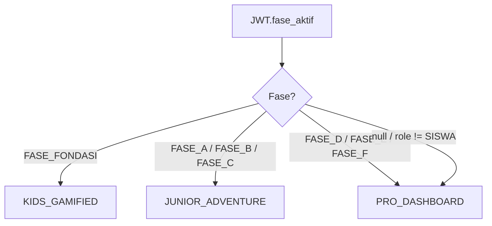
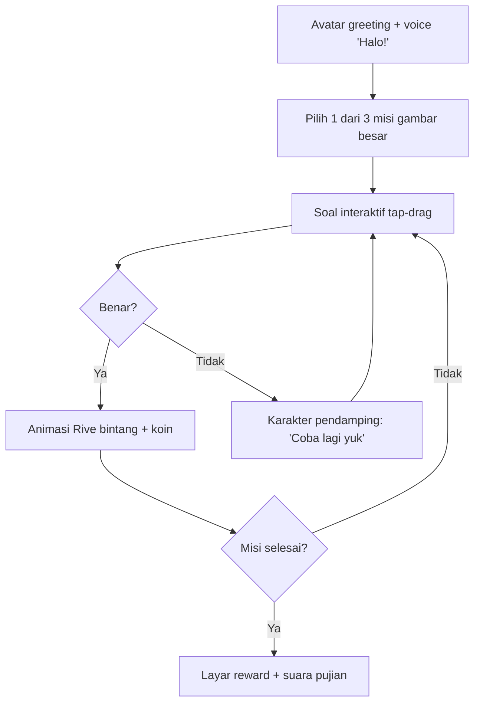
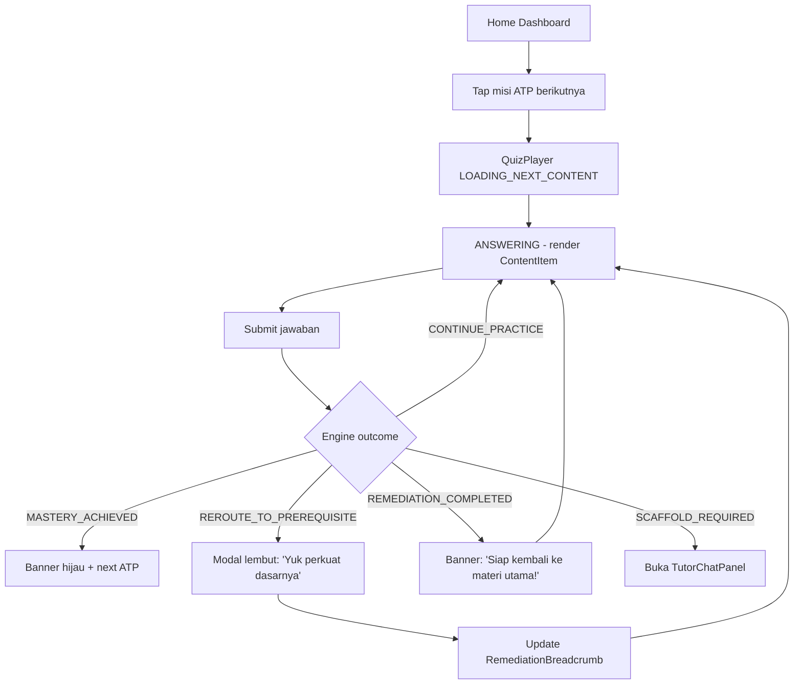
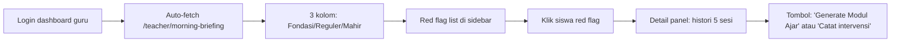
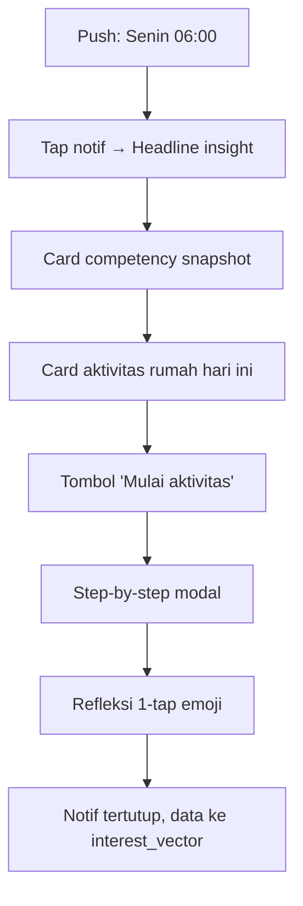
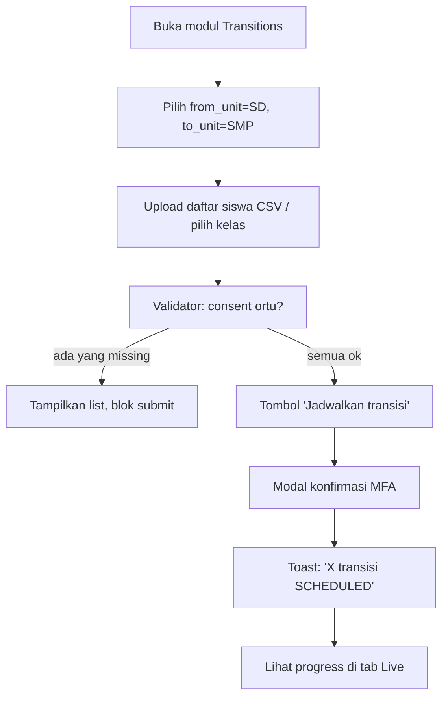
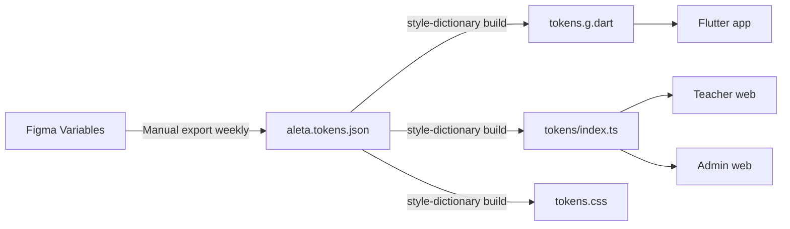

# FILE: 14_UI_UX_DESIGN_SYSTEM.md
# PROJECT ALETA: UI/UX DESIGN SYSTEM & INTERACTION SPECIFICATION

> ⚠️ **STRICT ENFORCEMENT**: ZERO warna hardcoded di production code. Semua warna harus lewat design tokens. Lihat GLOSSARY.md §9 dan §3 dokumen ini.

## 1. PENDAHULUAN

Dokumen-dokumen sebelumnya (Doc 05/06/11/12) mendefinisikan **arsitektur frontend** — state management, routing, komponen Flutter/React, accessibility. Yang masih kosong adalah **UI/UX sebagai disiplin tersendiri**: design tokens, voice & microcopy, user flows per persona, gesture map, animation budget, dan handoff process.

Dokumen ini menutup gap tersebut, dengan pembagian sumber kebenaran:
* **File ini (Markdown)** = bagian *text-renderable*: design tokens dalam JSON, microcopy library, user flow Mermaid, state matrix komponen, accessibility checklist.
* **Figma yayasan** = bagian *visual-heavy*: mockup hi-fi, prototype interaktif, ilustrasi, video animasi.

Vibe coding mengonsumsi token + microcopy + flow dari sini, lalu refer ke Figma untuk aset visual.

---

## 2. TIGA MODE UX FASE-DRIVEN

Sesuai Doc 05 §2, aplikasi siswa mengubah seluruh perasaan UI berdasar `fase_aktif`. Tabel di bawah adalah **kontrak desain definitif**:

| Mode | Fase | Mood | Density | Reading load | Animasi |
| :--- | :--- | :--- | :--- | :--- | :--- |
| `KIDS_GAMIFIED` | Fondasi (TK) | Playful, hangat, gemas | Sangat longgar | Hampir 0 teks; ikon + voice-over | Tinggi (Rive idle loop) |
| `JUNIOR_ADVENTURE` | A–C (SD) | Petualangan, koleksi, eksplorasi | Longgar | Sedang; teks pendek + ilustrasi | Sedang (Rive on-action) |
| `PRO_DASHBOARD` | D–F (SMP/SMA) | Profesional, fokus, data-aware | Padat tapi rapi | Tinggi; grafik + insight | Minim (transisi halus 200ms) |

Mode untuk surface lain (parent, teacher, admin) **selalu** `PRO_DASHBOARD` dengan voice yang berbeda (lihat §7).

### Decision Tree Mode



---

## 3. DESIGN TOKENS (CANONICAL JSON)

Semua nilai di bawah ini adalah **single source of truth**. Disimpan di `infrastructure/design_tokens/aleta.tokens.json` dan diekspor ke Dart (`lib/core/theme/tokens.g.dart`) dan TypeScript (`packages/tokens/dist/index.ts`) via Style Dictionary (lihat §14).

```json
{
  "color": {
    "kidsGamified": {
      "primary":    { "value": "#FFB300", "type": "color", "comment": "Amber 600 — tombol utama" },
      "onPrimary":  { "value": "#3E2723", "type": "color" },
      "secondary":  { "value": "#FF7043", "type": "color", "comment": "Orange — reward / koin" },
      "background": { "value": "#EFFFEC", "type": "color" },
      "surface":    { "value": "#FFFFFF", "type": "color" },
      "success":    { "value": "#66BB6A", "type": "color" },
      "warning":    { "value": "#FFCA28", "type": "color" },
      "error":      { "value": "#EF5350", "type": "color" },
      "textHigh":   { "value": "#3E2723", "type": "color" },
      "textMid":    { "value": "#5D4037", "type": "color" }
    },
    "juniorAdventure": {
      "primary":    { "value": "#1976D2", "type": "color" },
      "onPrimary":  { "value": "#FFFFFF", "type": "color" },
      "secondary":  { "value": "#00897B", "type": "color" },
      "background": { "value": "#F0F4F8", "type": "color" },
      "surface":    { "value": "#FFFFFF", "type": "color" },
      "success":    { "value": "#2E7D32", "type": "color" },
      "warning":    { "value": "#F57C00", "type": "color" },
      "error":      { "value": "#C62828", "type": "color" },
      "textHigh":   { "value": "#102A43", "type": "color" },
      "textMid":    { "value": "#486581", "type": "color" }
    },
    "proDashboard": {
      "primary":    { "value": "#0F172A", "type": "color", "comment": "Slate 900" },
      "onPrimary":  { "value": "#F8FAFC", "type": "color" },
      "secondary":  { "value": "#0EA5E9", "type": "color" },
      "background": { "value": "#FFFFFF", "type": "color" },
      "surface":    { "value": "#F8FAFC", "type": "color" },
      "success":    { "value": "#16A34A", "type": "color" },
      "warning":    { "value": "#D97706", "type": "color" },
      "error":      { "value": "#DC2626", "type": "color" },
      "redFlag":    { "value": "#BE123C", "type": "color", "comment": "Rose 700 — khusus alert guru" },
      "textHigh":   { "value": "#0F172A", "type": "color" },
      "textMid":    { "value": "#475569", "type": "color" },
      "textLow":    { "value": "#94A3B8", "type": "color" }
    }
  },
  "typography": {
    "fontFamily": {
      "kidsGamified":     { "value": "Fredoka", "fallback": "ComicSans, sans-serif" },
      "juniorAdventure":  { "value": "Nunito", "fallback": "system-ui, sans-serif" },
      "proDashboard":     { "value": "Inter", "fallback": "system-ui, sans-serif" }
    },
    "scale": {
      "kidsGamified": {
        "display": { "size": 40, "lineHeight": 48, "weight": 700 },
        "title":   { "size": 28, "lineHeight": 36, "weight": 700 },
        "body":    { "size": 20, "lineHeight": 28, "weight": 500 },
        "caption": { "size": 16, "lineHeight": 22, "weight": 500 }
      },
      "juniorAdventure": {
        "display": { "size": 30, "lineHeight": 38, "weight": 700 },
        "title":   { "size": 22, "lineHeight": 30, "weight": 700 },
        "body":    { "size": 16, "lineHeight": 24, "weight": 400 },
        "caption": { "size": 13, "lineHeight": 18, "weight": 500 }
      },
      "proDashboard": {
        "display": { "size": 28, "lineHeight": 34, "weight": 700 },
        "title":   { "size": 20, "lineHeight": 28, "weight": 600 },
        "body":    { "size": 14, "lineHeight": 20, "weight": 400 },
        "caption": { "size": 12, "lineHeight": 16, "weight": 500 }
      }
    }
  },
  "spacing": {
    "0": 0, "1": 4, "2": 8, "3": 12, "4": 16, "5": 20,
    "6": 24, "8": 32, "10": 40, "12": 48, "16": 64
  },
  "radius": {
    "kidsGamified":    { "card": 24, "button": 32, "input": 20 },
    "juniorAdventure": { "card": 16, "button": 16, "input": 10 },
    "proDashboard":    { "card": 12, "button": 8,  "input": 6 }
  },
  "elevation": {
    "level0": { "shadow": "none" },
    "level1": { "shadow": "0 1px 2px rgba(15,23,42,0.06)" },
    "level2": { "shadow": "0 4px 8px rgba(15,23,42,0.08)" },
    "level3": { "shadow": "0 12px 24px rgba(15,23,42,0.12)" }
  },
  "motion": {
    "duration": { "instant": 80, "fast": 150, "base": 220, "slow": 320, "reveal": 480 },
    "easing": {
      "standard": "cubic-bezier(0.2, 0.0, 0.0, 1.0)",
      "emphasized": "cubic-bezier(0.2, 0.0, 0.0, 1.4)",
      "decelerate": "cubic-bezier(0.0, 0.0, 0.2, 1.0)"
    },
    "reducedMotion": { "duration": 0, "easing": "linear" }
  },
  "touchTarget": {
    "min": 48,
    "kidsGamified": 64
  }
}
```

### Aturan Pemakaian Token (STRICT — No Exceptions)

> **CANONICAL**: Lihat GLOSSARY.md §9 untuk enforcement policy lengkap.

**Rule 1: ZERO Hardcoded Colors**

❌ **DILARANG**:
```tsx
// React — hardcoded Tailwind
<div className="bg-amber-50 text-red-600">...</div>

// React — hardcoded hex/rgb
<Box sx={{ backgroundColor: '#FEF3C7', color: 'rgb(220, 38, 38)' }}>...</Box>

// Flutter — hardcoded Color
Container(color: Color(0xFFFFB300))
```

✅ **WAJIB**:
```tsx
// React — semantic tokens via Tailwind config
<div className="bg-surface-warning text-content-error">...</div>

// React — CSS variables
<Box sx={{ backgroundColor: 'var(--color-surface-warning)', color: 'var(--color-content-error)' }}>...</Box>

// Flutter — theme tokens
Container(color: theme.colorScheme.surface)
```

**Semantic Color Tokens** (dari `aleta.tokens.json` export):
* `--color-primary-*`
* `--color-surface-*` (default, elevated, warning, error, success)
* `--color-content-*` (primary, secondary, tertiary, error, success, warning)
* `--color-background`
* `--color-on-primary`, `--color-on-surface`

**Rule 2: Mengubah Palette = Update JSON Only**

Jangan edit warna di Dart/TSX/CSS. Flow wajib:
1. Edit `infrastructure/design_tokens/aleta.tokens.json`.
2. Run `make tokens` (Style Dictionary transform).
3. Output auto-generated: `lib/core/theme/tokens.g.dart`, `packages/tokens/dist/index.ts`.
4. Commit JSON + generated files.

**Rule 3: Spacing Kelipatan 4 Saja**

Sub-pixel (`5px`, `7px`, `11px`) terlarang. Hanya `spacing.0` sampai `spacing.16` (0, 4, 8, 12, 16, 20, 24, 32, 40, 48, 64).

**Rule 4: Typography Scale Wajib**

Jangan hardcode `fontSize: 18px`. Pakai `typography.scale.<mode>.<role>` (display, title, body, caption).

**Rule 5: Motion Duration Wajib**

Jangan hardcode `duration: 250ms`. Pakai `motion.duration.<tier>` (instant, fast, base, slow, reveal). Respect `motion.reducedMotion` untuk a11y.

---

### Token Enforcement (CI Gate)

**ESLint** (`packages/web/*`):
```json
{
  "rules": {
    "no-hardcoded-colors": "error",
    "tailwindcss/no-arbitrary-value": ["error", { "except": ["spacing"] }]
  }
}
```

**Flutter Lint** (`analysis_options.yaml`):
```yaml
linter:
  rules:
    - avoid_hardcoded_colors
    - prefer_const_constructors
```

**CI Action** (Gitea Actions):
```yaml
- name: Lint Frontend
  run: |
    make lint-web  # ESLint no-hardcoded-colors
    make lint-flutter  # Dart analyzer
    # Jika ada error → block PR
```

**Manual Review Checklist** (PR template):
* [ ] Tidak ada `#XXXXXX`, `rgb()`, `Color(0x...)` di diff.
* [ ] Tidak ada Tailwind arbitrary `bg-[#...]` kecuali spacing `p-[17px]` untuk edge case.
* [ ] Semua warna lewat semantic tokens.

---

## 4. COMPONENT INVENTORY & STATE MATRIX

### A. Atoms (16 komponen)

| Nama | Surface | Variants | States wajib |
| :--- | :--- | :--- | :--- |
| `Button` | Flutter + React | `primary`, `secondary`, `ghost`, `destructive`, `icon` | default, hover, pressed, focus-visible, loading, disabled |
| `TextField` | Flutter + React | `text`, `numeric`, `password`, `search` | default, focus, error, disabled |
| `Avatar` | Flutter + React | `initial`, `image`, `emoji` (KIDS only) | default |
| `Badge` | Flutter + React | `count`, `dot`, `status` | success, warning, error, neutral |
| `Icon` | Flutter + React | inherit color | default |
| `Switch` | Flutter + React | — | default, on, off, disabled |
| `Checkbox` | Flutter + React | — | unchecked, checked, indeterminate, disabled |
| `Radio` | Flutter + React | — | unchecked, checked, disabled |
| `Chip` | Flutter + React | `interest`, `filter`, `assist` | default, selected, disabled |
| `ProgressBar` | Flutter + React | `linear`, `circular` | indeterminate, determinate |
| `Skeleton` | Flutter + React | `text`, `block`, `circle` | shimmer |
| `Toast` | Flutter + React | `success`, `info`, `warning`, `error` | enter, idle, exit |
| `Tag` | React only | `unit_type`, `fase`, `risk` | default |
| `Tooltip` | React only | — | default, hidden |
| `Divider` | Flutter + React | `horizontal`, `vertical` | default |
| `LottieView` | Flutter only | `celebration`, `idle_avatar`, `loading_kid` | playing, paused |

### B. Molecules (12 komponen)

`Card`, `ListItem`, `BottomNavBar`, `AppBar`, `EmptyState`, `ErrorState`, `LoadingState`, `BreadcrumbATP`, `QuizOption`, `MissionCard`, `RedFlagItem`, `ConsentRequest`.

### C. Organisms (10 komponen)

`HomeShellSiswa`, `HomeShellParent`, `QuizPlayer`, `RemediationBreadcrumb`, `MorningBriefingPanel`, `DifferentiationGroupCard` (Doc 06), `ATPBuilderCanvas` (Doc 11), `AuditLogTable`, `ConsentInbox`, `TutorChatPanel`.

### D. Sample State Matrix — `Button`

| State | Visual Cue | Trigger | Wajib di-test |
| :--- | :--- | :--- | :--- |
| default | warna `primary` | render awal | ✅ |
| hover (web) | brightness ×1.05 | mouse enter | ✅ |
| pressed | scale 0.97 + opacity 0.9 | tap/click down | ✅ |
| focus-visible | outline 2px `secondary` | keyboard tab | ✅ a11y |
| loading | spinner + label disembunyikan | `isLoading=true` | ✅ |
| disabled | opacity 0.4 + cursor not-allowed | `disabled=true` | ✅ |
| success-flash | tint hijau 220ms | post-success | optional |

Setiap komponen wajib menyertakan **8 cerita Storybook** (web) atau **8 widget tests** (Flutter) yang mencakup state di atas.

---

## 5. USER FLOWS PER PERSONA

### A. Golden Path Siswa TK — "Misi Pagi"



### B. Golden Path Siswa SMP — "Quiz dengan Remediation"



### C. Golden Path Guru — "Briefing Pagi"



### D. Golden Path Ortu — "Weekly Check"



### E. Golden Path Admin Yayasan — "Transisi Kelas 6 → 7"



---

## 6. MICROCOPY & VOICE GUIDELINES

### A. Voice Persona per Audience

| Audience | Karakter | Boleh | Tidak Boleh |
| :--- | :--- | :--- | :--- |
| **Siswa TK** | Hangat, gemas, suara pendek | Emoji, panggilan "kamu", kalimat ≤ 6 kata | Sarkasme, ironi, kata abstrak |
| **Siswa SD** | Pendamping petualangan | "Misi", "lencana", "rute belajar" | Jargon, vocab abstrak Matematika |
| **Siswa SMP/SMA** | Profesional muda, respek | Istilah teknis ringan, "Anda" opsional | Kata "kamu masih lemah", labeling negatif |
| **Guru** | Asisten taktis, hormat | Data-aware, actionable, ringkas | Menggurui, opini subjektif |
| **Orang Tua** | Apresiatif, memotivasi | Bahasa awam, positive framing | Angka mentah, ranking, "anak Anda tertinggal" |
| **Admin Yayasan** | Formal, governance | Istilah teknis, ringkas, prosedural | Casual, emoji |

### B. Tone Lintas-Mode (contoh ucapan yang sama)

| Konteks | TK | SD | SMP/SMA | Ortu |
| :--- | :--- | :--- | :--- | :--- |
| Mastery achieved | "Hebat! 🌟" | "Mantap! Lencana baru kamu dapat!" | "Tujuan Pembelajaran tercapai. ATP berikutnya siap." | "Anak Anda menyelesaikan kompetensi Aljabar minggu ini." |
| Remediation | "Yuk coba yang lebih mudah dulu!" | "Petualangan singkat ke peta sebelumnya, yuk!" | "Sistem mengarahkan Anda ke materi prasyarat sebentar." | (tidak ditampilkan) |
| Error koneksi | "Koneksinya ngambek 🙈" | "Sinyal hilang! Coba lagi yuk." | "Koneksi terputus. Ulangi?" | "Tidak dapat memuat. Periksa koneksi Anda." |

### C. Microcopy Library (Inti)

Disimpan di `lib/l10n/intl_id.arb` (Flutter) dan `packages/microcopy/id.json` (React). Contoh kunci wajib ada:

```json
{
  "common.retry": "Coba lagi",
  "common.cancel": "Batal",
  "common.confirm": "Konfirmasi",
  "common.loading_kids": "Sebentar ya...",
  "common.loading_pro": "Memuat data...",

  "quiz.outcome.mastery_tk": "Hebat! 🌟 Kamu jagoan!",
  "quiz.outcome.mastery_sd": "Mantap! Lencana baru kamu dapat!",
  "quiz.outcome.mastery_smp": "Tujuan Pembelajaran tercapai.",

  "quiz.remedial_intro_tk": "Yuk main yang lebih mudah dulu!",
  "quiz.remedial_intro_sd": "Petualangan kilat ke peta sebelumnya, yuk!",
  "quiz.remedial_intro_smp": "Sistem mengarahkan Anda ke materi prasyarat.",

  "tutor.handoff_required": "Yuk, ngobrol dulu dengan Bu/Pak guru BK kamu.",

  "parent.weekly.headline_template": "{name} menyelesaikan {n} kompetensi minggu ini.",
  "parent.no_numeric_disclaimer": "Kami sengaja tidak menampilkan nilai angka—fokus pada perkembangan.",

  "teacher.redflag.stuck_3_sessions": "{name} terjebak {tp} selama 3 sesi.",
  "teacher.briefing.empty_today": "Belum ada peringatan hari ini. Selamat mengajar!",

  "error.network": "Koneksi terputus. {retry_action}",
  "error.unauthorized": "Sesi berakhir. Silakan masuk kembali.",
  "error.idor_blocked": "Konten ini bukan untuk Anda."
}
```

### D. Aturan Penulisan
* **Capitalization:** Sentence case untuk semua label/button, kecuali nama proper (ALETA, Aljabar).
* **Tanda baca:** Tombol tanpa titik. Pesan kalimat penuh dengan titik.
* **Angka:** Format Indonesia (titik ribuan, koma desimal). Persentase pakai simbol `%` tanpa spasi.
* **Tidak ada ALL CAPS** kecuali tag teknis (`SMP`, `TK`, `LOW`).
* **Emoji:** Hanya di mode `KIDS_GAMIFIED` dan `JUNIOR_ADVENTURE`, maks 1 emoji per kalimat.

---

## 7. ICONOGRAPHY SYSTEM

* **Library default:** [Phosphor Icons](https://phosphoricons.com) — lisensi MIT, varian `regular`/`bold`/`fill`/`duotone`.
* **Custom icons** (untuk konsep Kurikulum Merdeka spesifik: `ATP`, `Paspor Kognitif`, `Fase`, `Remediation`) disimpan sebagai SVG di `infrastructure/icons/aleta/` dan diekspor ke font icon set `aleta-icons`.
* **Ukuran kanonik:** 16, 20, 24, 32, 48. Mode `KIDS_GAMIFIED` minimum 32; `PRO_DASHBOARD` minimum 16.
* **Stroke width:** 1.5px untuk semua mode, 2px hanya pada mode KIDS.
* **Color:** selalu mewarisi dari parent (`currentColor`). Tidak boleh hard-code.

### Semantic Mapping (Wajib Konsisten)

| Konsep | Icon |
| :--- | :--- |
| Mastery / capaian | `trophy` |
| Remediation | `arrow-uturn-left` |
| TP aktif | `target` |
| Misconception | `warning-circle` |
| Tutor AI | `robot` |
| Orang tua | `house-line` |
| Consent | `seal-check` |
| Red flag | `flag` (filled, color `redFlag`) |
| Audit log | `notebook` |
| ATP Builder | `flow-arrow` |

---

## 8. GESTURE & INTERACTION MAP

### A. Per Mode

| Gesture | KIDS_GAMIFIED | JUNIOR_ADVENTURE | PRO_DASHBOARD |
| :--- | :--- | :--- | :--- |
| Tap | ✅ utama | ✅ utama | ✅ utama |
| Double-tap | ❌ (rawan tidak sengaja) | optional | ✅ (mis. zoom grafik) |
| Long-press | ❌ | optional | ✅ (context menu) |
| Swipe horizontal | optional (carousel besar) | ✅ (pindah misi) | ✅ (pindah tab) |
| Swipe vertikal | ❌ | ✅ (scroll halus) | ✅ |
| Pinch zoom | ❌ | ❌ | ✅ (chart, ATP builder) |
| Drag-drop | ❌ | ✅ (puzzle ringan) | ✅ (ATP builder) |
| Shake | ❌ | ❌ | ❌ |

### B. Aturan Tap Anak (Kid-Safe)
1. **Tidak ada gesture destruktif tanpa konfirmasi 2-tap** untuk siswa TK & SD.
2. **Tombol "Keluar/Logout" disembunyikan** dari layar utama TK; hanya muncul di settings dengan icon gembok.
3. **Tidak ada link external** yang membuka browser dari aplikasi siswa.
4. **Tap target minimum 64×64 dp** di mode KIDS (Doc 05 §5.D), 48×48 dp di mode lain.

---

## 9. ACCESSIBILITY STANDARDS (WCAG 2.2 AA — WAJIB)

### Checklist Per Layar

* [ ] **Kontras teks** ≥ 4.5:1 untuk body, ≥ 3:1 untuk teks besar (≥18pt).
* [ ] **Tap target** ≥ 48×48 dp (≥ 64×64 dp KIDS).
* [ ] **Focus order** logis (kiri-ke-kanan, atas-ke-bawah).
* [ ] **Focus-visible outline** terlihat (token `outline 2px color.secondary`).
* [ ] **Semua interaktif punya label** (`Semantics(label:…)` di Flutter, `aria-label` di React).
* [ ] **Tidak ada info hanya via warna** (red flag harus + ikon + label, bukan cuma warna merah).
* [ ] **Animasi respek `prefers-reduced-motion`** (gunakan `motion.reducedMotion` token).
* [ ] **Bahasa elemen ter-set** (`<html lang="id">`, `MaterialApp.locale: Locale('id','ID')`).
* [ ] **Form field error punya teks**, bukan hanya warna merah.
* [ ] **Page memiliki landmark** (`<header>`, `<main>`, `<nav>`).
* [ ] **Heading hierarchy** tidak skip level.
* [ ] **Screen reader test** dengan TalkBack (Android) / VoiceOver (iOS) / NVDA (web).

### Test Otomatis
* Flutter: `flutter_test` + `accessibility_test` package — CI gagal jika ada widget tap < 48dp.
* React: `axe-core` di Vitest — CI gagal jika ada violation level `serious`.

---

## 10. MOTION & ILLUSTRATION GUIDELINES

### A. Performance Budget
* Total file `Rive` per layar ≤ **500 KB**.
* Total file `Lottie` per layar ≤ **150 KB**.
* Frame rate target 60 fps; degradasi ke 30 fps dibolehkan untuk device kelas bawah.
* **Tidak ada animasi auto-play looping** lebih dari 8 detik di latar belakang (battery drain).

### B. Kapan Pakai Apa
| Kebutuhan | Pilihan | Alasan |
| :--- | :--- | :--- |
| Karakter interaktif (mood, state) | **Rive** | State machine bawaan |
| Animasi UI sederhana (tombol, transisi) | **Built-in Flutter `AnimatedContainer`** | Ringan, native |
| Ilustrasi statis | **SVG (`flutter_svg` / ``)** | Resolution-independent |
| Animasi celebration sekali pakai | **Lottie** | Asset library besar |

### C. Reduced Motion
Jika `MediaQuery.disableAnimations == true` atau CSS `prefers-reduced-motion: reduce`:
* Semua animasi `> motion.duration.fast` (150ms) → di-skip atau jadi fade saja.
* Rive idle loop dihentikan; tampilkan frame pertama statis.

### D. Ilustrasi Brand
* Style: **flat dengan grain texture lembut**, palette mengikuti mode aktif.
* Karakter pendamping: 4 karakter (untuk varian rotasi mingguan):
  * **Nara** (kelinci penjelajah) — TK
  * **Bima** (panda penemu) — SD
  * **Sari** (rubah analitis) — SMP/SMA
  * **Pak Wira** (guru pamong virtual) — Tutor chat
* Sourcefile: `infrastructure/illustrations/*.riv` dan `*.svg`.

---

## 11. EMPTY / ERROR / LOADING STATE CATALOG

Setiap layar wajib mendefinisikan 3 state non-happy. Template:

### A. Empty State
```
[Ilustrasi 200×200]
[Headline title]
[Body caption singkat]
[Primary action button]
```

| Surface | Headline | Body | Action |
| :--- | :--- | :--- | :--- |
| Siswa - Mission empty | "Belum ada misi" | "Tutor sedang menyiapkan misi baru untukmu." | "Refresh" |
| Guru - Red flag empty | "Tidak ada peringatan" | "Selamat mengajar, semua siswa stabil hari ini." | (none) |
| Ortu - Activity empty | "Aktivitas siap segera" | "Kami sedang menyiapkan saran aktivitas rumah." | (none) |
| Admin - Audit empty | "Tidak ada event pada periode ini." | "Ubah filter untuk melihat data lain." | "Reset filter" |

### B. Error State
```
[Ilustrasi 'oops' 200×200]
[Headline lokal sesuai kategori]
[Body penjelasan singkat]
[Primary: action recovery] [Secondary: 'Laporkan']
```

| Kategori | Headline | Action utama |
| :--- | :--- | :--- |
| Network | "Koneksi terputus" | "Coba lagi" |
| Server (5xx) | "Sistem sedang istirahat sebentar" | "Coba lagi" |
| Auth (401) | "Sesi berakhir" | "Masuk kembali" |
| Forbidden (403) | "Konten ini bukan untuk Anda" | "Kembali" |
| Not found | "Tidak ada di sini" | "Kembali ke beranda" |

### C. Loading State
* < 200 ms → **tidak menampilkan spinner** (anti-flicker).
* 200ms – 2s → **skeleton** (mengikuti bentuk konten).
* \> 2s → skeleton + microcopy "Memuat data…" (atau "Sebentar ya..." di KIDS).
* \> 8s → tampilkan tombol "Batalkan" + kirim metric `slow_load_event` ke `audit_events` `risk_level='LOW'`.

---

## 12. BRAND IDENTITY

### A. Logo
* **Logomark:** karakter `A` stilasi dengan node graph kecil di pojok (representasi ontologi).
* **Logotype:** "ALETA" dalam font `Inter Bold` letter-spacing `-0.02em`.
* **Clearspace:** minimum 1× tinggi `A` di semua sisi.
* **Minimum size:** 24 px digital, 12 mm print.
* **Tidak boleh:** distort, tilt, gradient, drop-shadow, ganti warna di luar palette.

### B. App Icon
* iOS/Android: ikon 1024×1024 dengan latar `proDashboard.primary` (#0F172A), logomark putih.
* Tidak ada teks di app icon.
* Adaptive icon Android: foreground = logomark, background = `proDashboard.primary`.

### C. Splash Screen
* Background warna `proDashboard.background`.
* Logomark center.
* Tagline opsional: "AI Co-Pilot untuk Pendidikan Yayasan".
* Durasi maks 1.5 detik; tidak ada animasi panjang.

### D. Pemakaian di Dokumen Resmi Yayasan
Surat, sertifikat, modul ajar PDF yang digenerate sistem → kop logo + footer "Powered by ALETA".

---

## 13. FIGMA FILE INDEX

Sumber visual hi-fi disimpan di workspace Figma yayasan:

| File | Scope | Owner |
| :--- | :--- | :--- |
| `ALETA — Design Tokens` | Mirror token JSON, Figma Variables | Lead Designer |
| `ALETA — Mobile (Student)` | Layar Flutter mode KIDS, JUNIOR, PRO | Mobile Designer |
| `ALETA — Mobile (Parent)` | Build flavor parent (Doc 10) | Mobile Designer |
| `ALETA — Teacher Dashboard` | Layar React (Doc 06) | Web Designer |
| `ALETA — Admin Yayasan` | Layar React (Doc 11) | Web Designer |
| `ALETA — Illustrations & Characters` | Nara, Bima, Sari, Pak Wira | Illustrator |
| `ALETA — Brand Guidelines` | Logo, palette, do/don't | Brand Lead |

URL Figma di-store di `infrastructure/design_tokens/figma_links.json` (di-git-ignore karena mengandung file key).

---

## 14. HANDOFF PROCESS & TOKEN SYNC

### A. Aliran Token (Figma → Kode)



### B. Perintah Build Token

```bash
# Sekali setup
npm install -g style-dictionary

# Build (idempotent)
npm --prefix infrastructure/design_tokens run build
# → output:
#   ../../frontend_flutter/lib/core/theme/tokens.g.dart
#   ../../packages/tokens/dist/index.ts
#   ../../packages/tokens/dist/tokens.css
```

### C. Handoff Checklist Desainer → Engineer
* [ ] Komponen baru terdaftar di §4 (atom/molecule/organism).
* [ ] State matrix lengkap di Figma (default/hover/pressed/focus/loading/error/disabled).
* [ ] Microcopy dimasukkan ke `intl_id.arb` PR yang sama.
* [ ] Token baru ditambah ke `aleta.tokens.json`, tidak ada warna mentah di Figma file.
* [ ] Accessibility note tertulis (kontras, alt text, focus order).
* [ ] Asset ekspor (`@1x`, `@2x`, `@3x` PNG, atau SVG inline).
* [ ] Storybook (web) / Widgetbook (Flutter) story dibuat.

---

## 15. RELEASE GATE UI/UX

Sebelum sebuah surface ALETA dirilis ke production:

* [ ] **Design token** lulus build tanpa warning.
* [ ] **A11y test otomatis** (axe-core / flutter a11y) clean — 0 violation `serious`.
* [ ] **Manual a11y pass** dengan TalkBack/NVDA pada 3 golden path.
* [ ] **Mode parity check**: semua layar siswa di-test pada tiga mode (KIDS, JUNIOR, PRO) walau hanya satu yang aktif.
* [ ] **Microcopy review** oleh kurator bahasa yayasan (terutama TK).
* [ ] **Animation budget audit** (devtools timeline ≤ 16ms/frame di mid-range device).
* [ ] **Empty/error/loading** state ditampilkan di Storybook/Widgetbook.
* [ ] **Cross-device test**: minimum iPhone SE (375×667), Pixel 5 (393×851), iPad 10" (810×1080), web 1280×800.
* [ ] **Heuristic review** Nielsen 10 oleh design lead.
* [ ] **Sign-off design lead** + **product lead yayasan**.

Release gagal jika salah satu item di atas merah.
