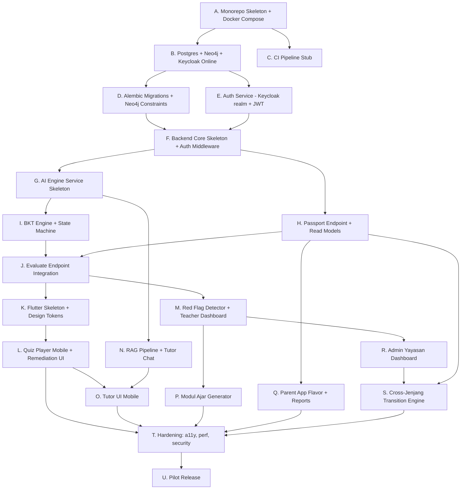

# FILE: 16_AI_AGENT_IMPLEMENTATION_PLAYBOOK.md
# PROJECT ALETA: AI AGENT IMPLEMENTATION PLAYBOOK

## 1. PENDAHULUAN & CARA MEMBACA DOKUMEN INI

16 blueprint sebelumnya menjawab **apa** yang harus dibangun. Dokumen ini menjawab **dalam urutan apa, oleh peran agent siapa, dengan prompt seperti apa, dan bagaimana memverifikasi hasilnya**. Ditulis untuk dua mode pemakaian:

* **Mode single-agent (Claude Code session)** — satu manusia berpasangan dengan satu Claude Code session, mengerjakan task linier mengikuti `Master Task Catalog` (§8).
* **Mode multi-agent** — orchestrator (manusia atau supervisor agent) menjalankan beberapa Claude session/subagent paralel, dipisah by role (architect / backend / AI engine / Flutter / web / DBA / reviewer / QA), disinkronkan via `Handoff Contracts` (§12).

### Stabilitas Konten
| Bagian | Stabilitas | Boleh diubah |
| :--- | :--- | :--- |
| §2 Prinsip anti-drift | **Stabil** | Hanya via ADR |
| §3 Dependency graph | **Stabil** | Hanya via ADR |
| §7 Task card format | **Stabil** | Hanya via ADR |
| §12 Handoff contracts | **Stabil** | Hanya via ADR |
| §4 Phase milestones | Heuristik | Boleh disesuaikan kondisi real |
| §6 Pilihan model | Heuristik | Disesuaikan budget/SLA |
| §8 Master task catalog | Living | Tambah/edit task seiring penemuan |
| §9 Sample prompts | Living | Iterasi sesuai apa yang efektif |

Setiap perubahan bagian stabil **wajib** lewat Architecture Decision Record di `docs/adr/`.

### Cara Agent Membaca Dokumen Ini
1. Baca §2 (anti-drift), §3 (dependency graph), §7 (task card format) → konteks dasar.
2. Lihat fase aktif di §4 → identifikasi task berikut.
3. Buka task card di §8 → ambil daftar blueprint yang harus di-load.
4. Load **hanya** blueprint yang disebut task card (hemat context window).
5. Eksekusi → jalankan anti-drift check (§11) → handoff (§12).

---

## 2. PRINSIP ANTI-DRIFT (5 ATURAN MUTLAK)

Lima aturan berikut **tidak boleh dilanggar** oleh agent manapun. Jika ada konflik dengan instruksi lain, aturan ini menang.

### Aturan 1 — Load Blueprint Sebelum Bertindak
Jangan menulis kode/file tanpa terlebih dulu membaca blueprint yang di-list `blueprints` dalam task card. Jika task card tidak ada, refuse dan minta task card dibuat dulu.

### Aturan 2 — Path Harus dari Doc 15
Setiap file baru harus diletakkan di path yang **disebutkan** atau **konsisten dengan pohon kanonik** di `15_PROJECT_STRUCTURE.md` §3–11. Jika path tidak ada di Doc 15, refuse dan minta Doc 15 di-update terlebih dulu (lewat ADR), bukan freestyle.

### Aturan 3 — Verifikasi Sebelum Commit
Sebelum claim task selesai:
* Build/lint/test berjalan sukses lokal.
* Anti-drift checklist §11 lulus.
* Output sesuai `Definition of Done` task card.

### Aturan 4 — Sebut Sumber pada Setiap Klaim
Saat menulis kode yang menerapkan kebijakan domain (mis. threshold BKT 0.85, retensi 90 hari, role matrix), tulis komentar singkat dengan referensi blueprint section (`# Doc 02 §2` atau `// Doc 07 §C`) supaya audit drift mudah.

### Aturan 5 — Jangan Lewati Dependensi
Tidak boleh mengerjakan task `B` sebelum task `A` yang menjadi `depends_on` selesai (sesuai §3 graph). Jika dipaksa, hasilnya akan rework — refuse dan eskalasi.

---

## 3. DEPENDENCY GRAPH IMPLEMENTASI

Berikut graf dependensi tingkat tinggi antar **kelompok kerja** (bukan task individual). Setiap node mewakili kemampuan yang harus tersedia sebelum node dependent dapat dimulai.



### Critical Path
Jalur paling panjang yang menentukan minimum durasi: `A → B → D/E → F → G → I → J → K → L → T → U`. Optimasi pada jalur ini berdampak langsung ke timeline; cabang lain (M, N, P, Q, R) dapat berjalan paralel setelah J selesai.

---

## 4. PHASE MILESTONES (HEURISTIK)

> **Catatan:** Durasi di bawah adalah heuristik untuk tim 3–4 manusia + multi-agent Claude. Tim solo + single-agent ≈ 2× durasi.

### Phase 0 — Bootstrap (Day 0–2)
**Tujuan:** Repo bisa di-clone, `make dev` berjalan, semua container hidup tapi belum melakukan apa-apa.
**Exit criteria:** Doc 08 docker-compose `up -d` sukses; Keycloak admin UI accessible; Postgres/Neo4j/Redis healthcheck hijau.
**Tasks:** T-001 ... T-005.

### Phase 1 — Foundation (Day 3–7)
**Tujuan:** Identity + persistence layer siap. Login bisa, schema lengkap, RLS aktif.
**Exit criteria:** `POST /api/v1/auth/login` mengembalikan JWT valid; `alembic upgrade head` clean; Neo4j constraints terpasang.
**Tasks:** T-101 ... T-109.

### Phase 2 — Adaptive Core (Day 8–14)
**Tujuan:** Loop adaptif backend selesai end-to-end (passport → next-content → evaluate → state machine).
**Exit criteria:** Tes integrasi: siswa fiktif dapat menyelesaikan 10 evaluate sukses dengan remediation 2-step.
**Tasks:** T-201 ... T-212.

### Phase 3 — Student Mobile + Quiz Loop (Day 15–21)
**Tujuan:** Aplikasi siswa Flutter berjalan end-to-end untuk fase SMP (mode PRO_DASHBOARD).
**Exit criteria:** Integration test golden path SMP hijau; siswa demo lulus 1 TP + 1 remediation siklus.
**Tasks:** T-301 ... T-313.

### Phase 4 — Teacher Dashboard + Red Flag (Day 22–28)
**Tujuan:** Guru bisa lihat differentiation card + red flag, generate Modul Ajar.
**Exit criteria:** Dashboard render data realistis dari 1 kelas demo; red flag detector backend menghasilkan output deterministik.
**Tasks:** T-401 ... T-411.

### Phase 5 — RAG & Tutor (Day 29–35)
**Tujuan:** Chatbot tutor 24/7 hidup, RAG rewrite konten aktif untuk minimum 1 mata pelajaran.
**Exit criteria:** Prompt injection corpus pass rate ≥ 95%; latency p95 ≤ 3.5s; handoff flow berjalan.
**Tasks:** T-501 ... T-511.

### Phase 6 — Parent + Admin (Day 36–42)
**Tujuan:** Aplikasi parent flavor live; admin dashboard punya minimum: Overview, Curriculum, Users, System Config.
**Exit criteria:** Ortu demo lihat headline insight + 1 aktivitas rumah; admin bisa add tenant + update threshold redflag.
**Tasks:** T-601 ... T-611.

### Phase 7 — Cross-Jenjang Transition (Day 43–49)
**Tujuan:** Transition engine berfungsi single + bulk; passport letter PDF generated.
**Exit criteria:** E2E test TK→SD→SMP→SMA pada siswa fiktif: passport tetap utuh, audit lengkap.
**Tasks:** T-701 ... T-709.

### Phase 8 — Hardening & Pilot Release (Day 50–56)
**Tujuan:** Lulus seluruh release gate Doc 13 §9, Doc 07, Doc 14 §15.
**Exit criteria:** Bandit/pip-audit/trivy/gitleaks clean HIGH+CRITICAL; load test backbone passes; backup restore drill < 2 jam.
**Tasks:** T-801 ... T-810.

---

## 5. MULTI-AGENT TOPOLOGY

### Daftar Peran (Roles)

| Role | Deskripsi | Model Rekomendasi |
| :--- | :--- | :--- |
| **architect** | Membuat ADR, memutuskan trade-off, menulis task card baru, melakukan threat modeling | Opus |
| **dba** | Migrasi Postgres + Neo4j, indeks, RLS, retention jobs | Sonnet |
| **backend-coder** | Implementasi `backend_core/` (API, services, repositories) | Sonnet |
| **ai-engine-coder** | Implementasi `ai_engine/` (BKT, RAG, tutor, safety) | Opus untuk algoritma inti, Sonnet untuk wiring |
| **flutter-coder** | Implementasi `frontend_flutter/` | Sonnet |
| **web-coder** | Implementasi `teacher_dashboard_web/` & `admin_dashboard_web/` | Sonnet |
| **devops** | docker-compose, nginx, CI/CD, observability | Sonnet |
| **security-reviewer** | Review setiap PR sensitif (auth, RLS, LLM safety) | Opus |
| **qa** | Menulis tes, run integration, validate against blueprint | Sonnet/Haiku |
| **doc-keeper** | Memperbarui blueprint saat ada penemuan baru, menjaga konsistensi | Sonnet |

### Topologi Paralelisme per Phase

```
Phase 0:  [devops] solo
Phase 1:  [dba] ∥ [backend-coder for auth] ∥ [devops for Keycloak realm]
            └─ sync point: T-109 selesai
Phase 2:  [ai-engine-coder] ∥ [backend-coder for endpoints] ∥ [qa for fixtures]
            └─ sync point: T-208 selesai
Phase 3:  [flutter-coder] solo (heavy), [qa] parallel for golden path tests
Phase 4:  [web-coder] ∥ [backend-coder for red flag service]
Phase 5:  [ai-engine-coder] ∥ [flutter-coder for tutor UI]
            └─ sync point: T-508 + T-509 keduanya selesai sebelum integration
Phase 6:  [flutter-coder for parent] ∥ [web-coder for admin] ∥ [backend-coder for parent endpoints]
Phase 7:  [backend-coder] + [dba] paired (high-risk)
Phase 8:  [security-reviewer] (Opus) leading, semua role support
```

### Sync Points
Sync point adalah momen wajib **semua agent yang relevan** berhenti, hasil mereka direview oleh `architect` atau `security-reviewer`, dan baru lanjut. Tujuan: cegah dua agent paralel mengubah kontrak yang sama tanpa koordinasi.

Sync point default: setiap **exit criteria phase** + setiap task yang ditandai `requires_sync: true` di catalog.

### Konflik & Ownership
* Saat dua agent ingin sentuh file yang sama → yang punya `role` paling spesifik (mis. `flutter-coder` untuk `frontend_flutter/lib/`) yang berhak. Lainnya buka PR ke agent owner.
* File "milik bersama" (mis. `docker-compose.yml`, `openapi.yaml`) — hanya `architect` atau `devops` yang boleh ubah.
* `CODEOWNERS` di `.github/CODEOWNERS` mencatat owner per direktori — gunakan ini sebagai sumber kebenaran ownership saat ragu.

---

## 6. MODEL SELECTION STRATEGY (HEURISTIK)

| Situasi | Model | Alasan |
| :--- | :--- | :--- |
| Menulis ADR, threat model, atau API contract baru | **Opus** | Reasoning panjang, trade-off analysis |
| Mengimplementasikan endpoint dari spec yang sudah ada | **Sonnet** | Workhorse — cepat, cukup akurat |
| Refactor besar yang menyentuh ≥ 5 file | **Sonnet** dengan thinking enabled | Butuh konsistensi lintas-file |
| Menulis tes unit dari spec | **Sonnet/Haiku** | Pattern straightforward |
| Lint fixes, format, rename | **Haiku** | Cepat dan murah |
| Debug bug yang sulit (race condition, RLS leak, JWT validation) | **Opus** | Butuh dalam memahami sistem |
| Security review PR | **Opus** | Bias konservatif lebih aman |
| Generate boilerplate yang berulang (Pydantic schemas dari OpenAPI) | **Haiku** | Murah dan cukup |
| Menulis prompt LLM dalam kode (tutor, scaffold, rewrite) | **Opus** | Detail prompt safety krusial |
| UI tweaks kecil, copy editing | **Haiku** | — |

**Pedoman umum**: mulai task baru dengan Sonnet. Eskalasi ke Opus jika Sonnet membuat kesalahan dua kali berturut-turut. Turunkan ke Haiku jika task ternyata mekanik.

---

## 7. TASK CARD FORMAT

Setiap task di Master Catalog (§8) ditulis dengan format ini. Format ini bagian **stabil**.

```yaml
id: T-NNN                          # unik, urutan dalam phase
title: <verb-first short summary>
phase: <0..8>
role: <architect|dba|backend-coder|...|qa>
model: <opus|sonnet|haiku>
estimated_complexity: <S|M|L|XL>   # heuristik, S=<2h, M=<1d, L=<3d, XL=>3d
blueprints:                        # WAJIB di-load sebelum mulai
  - "<doc number>.<section>"       # mis. "02.§4"
depends_on: [<T-ID>, ...]
outputs:                           # file/artifact yang dihasilkan
  - <path relatif dari repo root>
definition_of_done:
  - <check 1>
  - <check 2>
handoff_to: [<T-ID>, ...]          # task yang membutuhkan output ini
anti_drift_checks:                 # spesifik untuk task ini
  - <check>
requires_sync: <true|false>        # apakah ini sync point?
notes: <opsional>
```

---

## 8. MASTER TASK CATALOG

### Phase 0 — Bootstrap (T-001 ... T-005)

```yaml
- id: T-001
  title: Initialize monorepo skeleton
  phase: 0
  role: devops
  model: sonnet
  estimated_complexity: S
  blueprints: ["16.§2", "16.§15", "16.§16"]
  depends_on: []
  outputs:
    - README.md
    - .gitignore
    - .editorconfig
    - .nvmrc
    - .python-version
    - Makefile
    - pnpm-workspace.yaml
    - .env.example
    - empty folders per Doc 15 §2 with .gitkeep
  definition_of_done:
    - "`make help` menampilkan ≥ 7 target"
    - "Struktur folder cocok 100% dengan Doc 15 §2"
    - "`tree -L 2 -I 'node_modules|.venv'` snapshot disimpan ke docs/handbook/initial_tree.txt"
  handoff_to: [T-002, T-003]
  anti_drift_checks:
    - "Tidak ada folder yang tidak disebut Doc 15 §3-11"
  requires_sync: false

- id: T-002
  title: Setup docker-compose with 12 services + healthchecks
  phase: 0
  role: devops
  model: sonnet
  estimated_complexity: M
  blueprints: ["08.§3", "08.§4"]
  depends_on: [T-001]
  outputs:
    - docker-compose.yml
    - docker-compose.override.example.yml
    - infrastructure/nginx/nginx.conf
    - infrastructure/nginx/snippets/sse.conf
    - infrastructure/nginx/snippets/security_headers.conf
  definition_of_done:
    - "`docker compose config` valid"
    - "`docker compose up -d` membawa 12 service ke healthy state ≤ 5 menit"
    - "`curl https://api.aleta.localhost/api/v1/health` (via /etc/hosts + self-signed cert) mengembalikan 200"
  handoff_to: [T-101, T-104]
  anti_drift_checks:
    - "Service name persis: aleta_postgres, aleta_neo4j, aleta_redis, aleta_ollama, aleta_keycloak, aleta_core_api, aleta_ai_engine, aleta_vector_db, aleta_teacher_dashboard, aleta_admin_dashboard, aleta_api_gateway, aleta_backup"
    - "Tidak ada secret hard-coded; semua via ${ALETA_*}"
  requires_sync: true

- id: T-003
  title: Generate .env.example dan rotasi script
  phase: 0
  role: devops
  model: haiku
  estimated_complexity: S
  blueprints: ["07.§A", "08.§4"]
  depends_on: [T-001]
  outputs:
    - .env.example
    - scripts/rotate_secrets.sh
  definition_of_done:
    - "Semua var yang dipakai docker-compose.yml ada di .env.example"
    - "Tidak ada nilai default yang bisa dipakai production"
  handoff_to: [T-002]
  anti_drift_checks: []
  requires_sync: false

- id: T-004
  title: Setup Keycloak realm export + auto-import
  phase: 0
  role: devops
  model: sonnet
  estimated_complexity: M
  blueprints: ["07.§B", "14.§6"]
  depends_on: [T-002]
  outputs:
    - infrastructure/keycloak/aleta-realm.json
  definition_of_done:
    - "Realm 'aleta' otomatis ter-import saat aleta_keycloak start"
    - "Clients: aleta-api, aleta-flutter, aleta-teacher-web, aleta-admin-web terdaftar"
    - "Roles: SUPERADMIN, ADMIN_YAYASAN, GURU, SISWA, ORANG_TUA terdaftar"
    - "Protocol mappers untuk tenant_id, schema_scope, fase_aktif, role aktif"
    - "MFA required action ter-set untuk SUPERADMIN/ADMIN_YAYASAN/GURU"
    - "Brute force protection: 5 attempts, lockout 15min"
  handoff_to: [T-101, T-108]
  anti_drift_checks:
    - "Algoritma token RS256/ES256, BUKAN HS256 (Doc 07 §B)"
  requires_sync: true

- id: T-005
  title: Bootstrap CI workflow stub
  phase: 0
  role: devops
  model: haiku
  estimated_complexity: S
  blueprints: ["14.§5"]
  depends_on: [T-001]
  outputs:
    - .github/workflows/ci.yml
    - .github/CODEOWNERS
    - .github/pull_request_template.md
  definition_of_done:
    - "ci.yml lint workflow valid (`act` atau equivalent)"
    - "CODEOWNERS memetakan setiap top-level service ke role"
  handoff_to: []
  anti_drift_checks: []
  requires_sync: false
```

### Phase 1 — Foundation (T-101 ... T-109)

```yaml
- id: T-101
  title: Alembic migrations untuk aleta_core (8 tabel utama)
  phase: 1
  role: dba
  model: sonnet
  estimated_complexity: L
  blueprints: ["03.§2", "03.§3"]
  depends_on: [T-002, T-004]
  outputs:
    - backend_core/alembic.ini
    - backend_core/alembic/env.py
    - backend_core/alembic/versions/20260101_0001_initial_core_schema.py
    - backend_core/alembic/versions/20260101_0002_passport_and_affective.py
    - backend_core/alembic/versions/20260101_0003_misconceptions_session_state.py
    - backend_core/alembic/versions/20260101_0004_consent_transition.py
    - backend_core/alembic/versions/20260101_0005_tutor_modul_ajar.py
    - backend_core/alembic/versions/20260101_0006_audit_events.py
    - backend_core/alembic/versions/20260101_0008_system_config.py
  definition_of_done:
    - "`alembic upgrade head` clean dari blank DB"
    - "Semua tabel di Doc 03 §2 + §3.A-M terbuat"
    - "Constraints CHECK aktif (mis. p_guess ≤ 0.30 di tp_bkt_params)"
    - "Index per Doc 03 ter-buat"
  handoff_to: [T-105, T-201, T-205]
  anti_drift_checks:
    - "Threshold dan ENUM persis sama dengan Doc 03"
    - "Tidak ada kolom yang tidak ada di Doc 03"
  requires_sync: false

- id: T-102
  title: Tenant template SQL untuk unit_smp (acuan)
  phase: 1
  role: dba
  model: sonnet
  estimated_complexity: M
  blueprints: ["03.§3 (unit_smp)", "14.§2"]
  depends_on: [T-101]
  outputs:
    - backend_core/alembic/tenant_template/001_classes.sql
    - backend_core/alembic/tenant_template/002_enrollment.sql
    - backend_core/alembic/tenant_template/003_quiz_logs.sql
    - backend_core/alembic/versions/20260101_0007_unit_schema_template.py
  definition_of_done:
    - "Saat `apply_tenant_template('unit_smp')` dipanggil, tabel classes/enrollment/quiz_logs/class_subject_teachers terbuat"
  handoff_to: [T-105]
  anti_drift_checks: []
  requires_sync: false

- id: T-103
  title: Neo4j bootstrap constraints + seed
  phase: 1
  role: dba
  model: sonnet
  estimated_complexity: M
  blueprints: ["01.§5.A", "01.§5.B", "14.§3"]
  depends_on: [T-002]
  outputs:
    - backend_core/neo4j_migrations/V001__constraints.cypher
    - backend_core/neo4j_migrations/V002__seed_institution.cypher
    - backend_core/backend_core/scripts/neo4j_bootstrap.cypher
    - backend_core/backend_core/scripts/run_neo4j_migrations.py
  definition_of_done:
    - "Semua CREATE CONSTRAINT dari Doc 01 §5.A ter-apply"
    - "Seed Institution + minimal 1 Unit untuk dev"
    - "Runner mencatat versi di node (:_SchemaVersion)"
  handoff_to: [T-203]
  anti_drift_checks: []
  requires_sync: false

- id: T-104
  title: Pydantic settings + logging setup
  phase: 1
  role: backend-coder
  model: sonnet
  estimated_complexity: S
  blueprints: ["08.§4 (.env)"]
  depends_on: [T-002]
  outputs:
    - backend_core/backend_core/config.py
    - backend_core/backend_core/logging_setup.py
    - backend_core/pyproject.toml
    - backend_core/requirements.txt
    - backend_core/requirements-dev.txt
    - backend_core/Dockerfile
  definition_of_done:
    - "Config load dari env tanpa default secret"
    - "Logging JSON structured, level ENV-controlled"
  handoff_to: [T-106]
  anti_drift_checks: []
  requires_sync: false

- id: T-105
  title: SQLAlchemy models lengkap (1 file per agg root)
  phase: 1
  role: backend-coder
  model: sonnet
  estimated_complexity: L
  blueprints: ["03 (semua)"]
  depends_on: [T-101, T-102, T-104]
  outputs:
    - backend_core/backend_core/db/session.py
    - backend_core/backend_core/db/tenant_scope.py
    - backend_core/backend_core/db/models/*.py
  definition_of_done:
    - "Model untuk: users, tenants, passport, affective, misconceptions, consent, transition, tutor, modul_ajar, audit, system_config, unit_smp tables"
    - "Type hints lengkap, mypy lulus"
  handoff_to: [T-107, T-108, T-201]
  anti_drift_checks:
    - "Tipe kolom cocok dengan Doc 03 SQL"
  requires_sync: false

- id: T-106
  title: FastAPI app skeleton + health endpoint
  phase: 1
  role: backend-coder
  model: sonnet
  estimated_complexity: S
  blueprints: ["04.§1", "16.§3"]
  depends_on: [T-104]
  outputs:
    - backend_core/backend_core/app.py
    - backend_core/backend_core/api/health.py
    - backend_core/backend_core/middleware/request_id.py
    - backend_core/backend_core/middleware/error_handler.py
    - backend_core/backend_core/schemas/errors.py
  definition_of_done:
    - "`GET /api/v1/health` mengembalikan 200 dengan status semua dependency"
    - "Error response sesuai Doc 04 §1 format"
    - "Setiap request punya X-Request-Id"
  handoff_to: [T-107, T-108]
  anti_drift_checks:
    - "Format error code prefix sesuai Doc 04 §1"
  requires_sync: false

- id: T-107
  title: SecurityGuard + JWKS cache + RLS helpers
  phase: 1
  role: backend-coder
  model: opus
  estimated_complexity: L
  blueprints: ["07.§3", "07.§B", "07.§D", "07.§5"]
  depends_on: [T-105, T-106, T-004]
  outputs:
    - backend_core/backend_core/security/guard.py
    - backend_core/backend_core/security/jwks_cache.py
    - backend_core/backend_core/security/rls.py
    - backend_core/backend_core/security/idempotency.py
    - backend_core/backend_core/security/rate_limit.py
  definition_of_done:
    - "JWT validasi pakai JWKS Keycloak (RS256), cache TTL 10 menit"
    - "`tenant_scope` set SET LOCAL search_path + claim sub/role"
    - "RLS policy untuk student_cognitive_passports aktif"
    - "Tests: invalid token → 401; cross-tenant access → 403; idempotency key dedup → 24h"
  handoff_to: [T-108]
  anti_drift_checks:
    - "Tolak HS256 secara explicit"
    - "Algoritma whitelist: ['RS256','ES256'] saja"
    - "schema_scope di-resolve via aleta_core.tenants, BUKAN raw dari JWT"
  requires_sync: true

- id: T-108
  title: Auth endpoints (login/refresh/logout)
  phase: 1
  role: backend-coder
  model: sonnet
  estimated_complexity: M
  blueprints: ["04.§3.A", "04.§2", "07.§B"]
  depends_on: [T-107]
  outputs:
    - backend_core/backend_core/api/auth.py
    - backend_core/backend_core/services/auth_service.py
    - backend_core/backend_core/clients/keycloak_client.py
    - backend_core/backend_core/schemas/auth.py
  definition_of_done:
    - "Login proxy ke Keycloak, return JWT + refresh"
    - "Refresh rotation aktif (refresh lama blacklist)"
    - "Logout revoke di Keycloak"
    - "Rate limit 5 attempts/menit/IP"
  handoff_to: [T-109, T-209]
  anti_drift_checks: []
  requires_sync: false

- id: T-109
  title: OpenAPI export + CI gate
  phase: 1
  role: devops
  model: sonnet
  estimated_complexity: S
  blueprints: ["14.§4"]
  depends_on: [T-108]
  outputs:
    - backend_core/backend_core/scripts/export_openapi.py
    - backend_core/openapi.yaml
    - update ke .github/workflows/ci.yml dengan diff job
  definition_of_done:
    - "`make openapi` regenerate file"
    - "CI gagal jika file out-of-sync"
  handoff_to: []
  anti_drift_checks: []
  requires_sync: true
```

### Phase 2 — Adaptive Core (T-201 ... T-212)

```yaml
- id: T-201
  title: ALETA_BKT_Engine + parameter provider
  phase: 2
  role: ai-engine-coder
  model: opus
  estimated_complexity: M
  blueprints: ["02.§2", "02.§4 (4.1)", "02.§6", "03.§3.F"]
  depends_on: [T-101, T-105]
  outputs:
    - ai_engine/ai_engine/adaptive_engine.py
    - ai_engine/ai_engine/bkt_params_provider.py
    - ai_engine/tests/unit/test_bkt_math.py
  definition_of_done:
    - "Math test: dari P(L)=0.30 + 5 jawaban benar → P(L) > 0.85"
    - "Division-by-zero handling pada P(L) ekstrem (clip 0.0001-0.9999)"
    - "Param provider load dari aleta_core.tp_bkt_params dengan cache 30min"
  handoff_to: [T-202, T-208]
  anti_drift_checks:
    - "Threshold persis: mastery=0.85, remedial=0.20"
    - "Constraint sanity p_guess≤0.30, p_slip≤0.10 di kode"
  requires_sync: false

- id: T-202
  title: MatchmakerEngine + state machine (NORMAL/IN_REMEDIATION/RETURNING_TO_MAIN)
  phase: 2
  role: ai-engine-coder
  model: opus
  estimated_complexity: L
  blueprints: ["02.§4 (4.2)", "02.§7", "03.§3.G"]
  depends_on: [T-201, T-203]
  outputs:
    - ai_engine/ai_engine/adaptive_engine.py (extend)
    - ai_engine/ai_engine/session_repository.py
    - ai_engine/tests/unit/test_remediation_state_machine.py
  definition_of_done:
    - "State transitions: NORMAL→IN_REMEDIATION→RETURNING_TO_MAIN→NORMAL"
    - "remediation_stack LIFO; primary_tp_id di dasar"
    - "REMEDIATION_COMPLETED → load p_l primary dari passport (BUKAN nilai remedial)"
    - "Test: 3-level remediation, ascend kembali ke primary"
  handoff_to: [T-208]
  anti_drift_checks:
    - "SCAFFOLD_REQUIRED hanya saat tidak ada prerequisite"
    - "Misconception forwarded ke outcome.misconception"
  requires_sync: true

- id: T-203
  title: GraphClient (Neo4j adapter untuk engine)
  phase: 2
  role: ai-engine-coder
  model: sonnet
  estimated_complexity: M
  blueprints: ["01.§5", "01.§6"]
  depends_on: [T-103]
  outputs:
    - ai_engine/ai_engine/graph_client.py
    - ai_engine/ai_engine/clients/qdrant_client.py (stub)
    - ai_engine/ai_engine/clients/ollama_client.py (stub)
  definition_of_done:
    - "fetch_immediate_prerequisite implementasi via Cypher"
    - "fetch_active_misconception implementasi"
    - "Connection pooling, timeout 5s, retry 1× pada transient error"
  handoff_to: [T-202]
  anti_drift_checks: []
  requires_sync: false

- id: T-204
  title: ai_engine FastAPI internal app
  phase: 2
  role: ai-engine-coder
  model: sonnet
  estimated_complexity: M
  blueprints: ["16.§4"]
  depends_on: [T-202]
  outputs:
    - ai_engine/ai_engine/app.py
    - ai_engine/ai_engine/api/evaluate.py
    - ai_engine/ai_engine/api/scaffold.py
    - ai_engine/Dockerfile
  definition_of_done:
    - "POST /internal/evaluate menerima session+is_correct, return outcome"
    - "Service hanya listen di internal network (Doc 08)"
  handoff_to: [T-208]
  anti_drift_checks:
    - "Service TIDAK boleh exposed lewat aleta_api_gateway"
  requires_sync: false

- id: T-205
  title: Session state repository (Postgres)
  phase: 2
  role: backend-coder
  model: sonnet
  estimated_complexity: S
  blueprints: ["03.§3.G", "03.§3.H"]
  depends_on: [T-105]
  outputs:
    - backend_core/backend_core/repositories/passport.py (extend)
    - backend_core/backend_core/repositories/users.py
  definition_of_done:
    - "Read/write student_session_state + student_current_position"
  handoff_to: [T-208, T-210]
  anti_drift_checks: []
  requires_sync: false

- id: T-206
  title: ai_engine_client di backend_core
  phase: 2
  role: backend-coder
  model: sonnet
  estimated_complexity: S
  blueprints: ["16.§3 (clients/)"]
  depends_on: [T-204]
  outputs:
    - backend_core/backend_core/clients/ai_engine_client.py
  definition_of_done:
    - "HTTP client dengan timeout, retry, circuit breaker"
  handoff_to: [T-208]
  anti_drift_checks: []
  requires_sync: false

- id: T-207
  title: Passport endpoint + read models
  phase: 2
  role: backend-coder
  model: sonnet
  estimated_complexity: M
  blueprints: ["04.§3.B", "07.§C"]
  depends_on: [T-107, T-205]
  outputs:
    - backend_core/backend_core/api/student.py
    - backend_core/backend_core/services/passport_service.py
    - backend_core/backend_core/schemas/passport.py
  definition_of_done:
    - "GET /student/passport: siswa lihat punyanya; guru cek kepemilikan kelas; ortu cek student_parent_relations"
    - "IDOR test pass"
    - "Pagination cursor-based"
  handoff_to: [T-301]
  anti_drift_checks:
    - "Object-level authz check sebelum return data"
  requires_sync: false

- id: T-208
  title: /engine/evaluate endpoint (integrasi penuh)
  phase: 2
  role: backend-coder
  model: opus
  estimated_complexity: L
  blueprints: ["04.§3.C", "02.§4", "02.§7"]
  depends_on: [T-202, T-205, T-206, T-207]
  outputs:
    - backend_core/backend_core/api/engine.py
    - backend_core/backend_core/services/passport_service.py (extend)
    - backend_core/backend_core/schemas/engine.py
  definition_of_done:
    - "POST /engine/evaluate: validate JWT → load session → call ai_engine_client → persist passport + session_state + misconception → return outcome"
    - "Idempotency-Key wajib, dedup 24h"
    - "Audit event ter-emit untuk REMEDIAL_TRIGGERED + MASTERY_ACHIEVED"
  handoff_to: [T-210, T-309]
  anti_drift_checks:
    - "Backend yang menulis passport, BUKAN ai_engine"
  requires_sync: true

- id: T-209
  title: /auth integration tests (smoke)
  phase: 2
  role: qa
  model: sonnet
  estimated_complexity: S
  blueprints: ["04.§3.A", "07.§C"]
  depends_on: [T-108]
  outputs:
    - backend_core/tests/security/test_jwt_validation.py
    - backend_core/tests/security/test_idor.py
  definition_of_done:
    - "Login + refresh + logout happy path"
    - "Token forge → 401, HS256 token → 401"
  handoff_to: []
  anti_drift_checks: []
  requires_sync: false

- id: T-210
  title: /student/next-content endpoint
  phase: 2
  role: backend-coder
  model: sonnet
  estimated_complexity: M
  blueprints: ["04.§3.E", "01.§6 (API 4)"]
  depends_on: [T-205, T-208]
  outputs:
    - backend_core/backend_core/api/student.py (extend)
    - backend_core/backend_core/services/next_content_service.py
  definition_of_done:
    - "Konsultasikan session_state: jika IN_REMEDIATION → fetch content untuk current_tp_id"
    - "Jika NORMAL → fetch berdasarkan ATPSequence position"
    - "Return remediation_breadcrumb saat IN_REMEDIATION"
  handoff_to: [T-309]
  anti_drift_checks: []
  requires_sync: false

- id: T-211
  title: BKT calibration job skeleton (no data yet)
  phase: 2
  role: ai-engine-coder
  model: sonnet
  estimated_complexity: M
  blueprints: ["02.§6"]
  depends_on: [T-201]
  outputs:
    - backend_core/backend_core/jobs/bkt_calibration.py
    - backend_core/backend_core/jobs/difficulty_rerating.py
    - backend_core/backend_core/jobs/worker.py
  definition_of_done:
    - "Job runner berbasis Celery/RQ"
    - "Dry-run mode aktif (no DB write) sampai data tersedia"
  handoff_to: []
  anti_drift_checks: []
  requires_sync: false

- id: T-212
  title: Integration test - end-to-end adaptive loop
  phase: 2
  role: qa
  model: sonnet
  estimated_complexity: M
  blueprints: ["02 (semua)", "04.§3.C, E"]
  depends_on: [T-208, T-210]
  outputs:
    - backend_core/tests/integration/test_engine_evaluate_flow.py
    - backend_core/tests/fixtures/seed.sql
    - backend_core/tests/fixtures/neo4j_seed.cypher
  definition_of_done:
    - "Siswa fiktif: 10 evaluate sukses dengan 2-step remediation"
    - "Passport ter-update sesuai threshold"
    - "audit_events tercatat untuk setiap state transition"
  handoff_to: [T-301]
  anti_drift_checks: []
  requires_sync: true   # EXIT CRITERIA Phase 2
```

### Phase 3 — Student Mobile + Quiz Loop (T-301 ... T-313)

```yaml
- id: T-301
  title: Flutter skeleton + 2 flavor (student/parent) + main entry
  phase: 3
  role: flutter-coder
  model: sonnet
  estimated_complexity: M
  blueprints: ["05.§1", "05.§5.E", "16.§5"]
  outputs:
    - frontend_flutter/pubspec.yaml
    - frontend_flutter/.flutter_flavorizr.yaml
    - frontend_flutter/lib/main_student.dart
    - frontend_flutter/lib/main_parent.dart
  depends_on: [T-001]
  definition_of_done:
    - "`flutter run --flavor student` boots ke splash"
    - "`flutter run --flavor parent` boots ke splash dengan route /learn diblok"
  handoff_to: [T-303, T-308]
  anti_drift_checks: []
  requires_sync: false

- id: T-302
  title: Design tokens build (Style Dictionary) → Dart + TS
  phase: 3
  role: web-coder    # owner tokens karena lebih nyaman di Node
  model: sonnet
  estimated_complexity: M
  blueprints: ["15.§3", "15.§14"]
  outputs:
    - infrastructure/design_tokens/aleta.tokens.json
    - infrastructure/design_tokens/style-dictionary.config.cjs
    - infrastructure/design_tokens/package.json
    - infrastructure/design_tokens/platforms/dart.template.dart
    - frontend_flutter/lib/core/theme/tokens.g.dart (generated)
    - packages/tokens/dist/index.ts (generated)
    - packages/tokens/dist/tokens.css (generated)
  depends_on: [T-001]
  definition_of_done:
    - "`make tokens` regenerate 3 platform output"
    - "Token JSON cocok 100% dengan Doc 14 §3"
  handoff_to: [T-303, T-402]
  anti_drift_checks:
    - "Tidak ada warna mentah di output Dart/TS — semua dari token"
  requires_sync: false

- id: T-303
  title: Theme system (fase_theme_config) + 3 mode rendering
  phase: 3
  role: flutter-coder
  model: sonnet
  estimated_complexity: M
  blueprints: ["05.§2", "05.§3", "15.§2"]
  outputs:
    - frontend_flutter/lib/core/theme/fase_theme_config.dart
    - frontend_flutter/lib/core/theme/motion.dart
  depends_on: [T-302]
  definition_of_done:
    - "Switching mode tidak memicu rebuild penuh app"
    - "Smoke widget test: ThemeData benar untuk 3 mode"
  handoff_to: [T-308]
  anti_drift_checks:
    - "Konsumsi tokens dari tokens.g.dart, BUKAN hard-code"
  requires_sync: false

- id: T-304
  title: AuthBloc + token store + secure storage
  phase: 3
  role: flutter-coder
  model: sonnet
  estimated_complexity: M
  blueprints: ["05.§4", "07.§B"]
  outputs:
    - frontend_flutter/lib/core/auth/token_store.dart
    - frontend_flutter/lib/core/auth/auth_bloc.dart
  depends_on: [T-301]
  definition_of_done:
    - "Token disimpan via flutter_secure_storage"
    - "AuthBloc states: AuthInitial/Loading/Authenticated/Error"
    - "Authenticated state membawa fase_aktif claim"
  handoff_to: [T-305, T-306]
  anti_drift_checks: []
  requires_sync: false

- id: T-305
  title: API client Dio + interceptors (auth/refresh/logging)
  phase: 3
  role: flutter-coder
  model: sonnet
  estimated_complexity: M
  blueprints: ["05.§5.B"]
  outputs:
    - frontend_flutter/lib/core/network/aleta_api_client.dart
    - frontend_flutter/lib/core/network/interceptors/auth_interceptor.dart
    - frontend_flutter/lib/core/network/interceptors/refresh_interceptor.dart
    - frontend_flutter/lib/core/network/interceptors/logging_interceptor.dart
  depends_on: [T-304]
  definition_of_done:
    - "401 → otomatis refresh + retry sekali"
    - "Logging redact PII (email, nama)"
    - "Idempotency-Key auto-inject untuk /engine/evaluate"
  handoff_to: [T-307, T-309]
  anti_drift_checks: []
  requires_sync: false

- id: T-306
  title: go_router config + route guards
  phase: 3
  role: flutter-coder
  model: sonnet
  estimated_complexity: S
  blueprints: ["05.§5.A", "11.§2"]
  outputs:
    - frontend_flutter/lib/core/routing/app_router.dart
    - frontend_flutter/lib/core/routing/route_guards.dart
  depends_on: [T-304]
  definition_of_done:
    - "Routes untuk student flavor: /splash, /login, /home, /learn/:subjectId, /tutor"
    - "Routes untuk parent flavor: /splash, /login, /home, /parent/report, /parent/activities, /parent/consents"
    - "Guard redirect ke /login jika unauthenticated"
  handoff_to: [T-308]
  anti_drift_checks: []
  requires_sync: false

- id: T-307
  title: OpenAPI Dart client generation
  phase: 3
  role: flutter-coder
  model: haiku
  estimated_complexity: S
  blueprints: ["14.§4.B"]
  outputs:
    - frontend_flutter/lib/core/network/generated/
  depends_on: [T-109, T-305]
  definition_of_done:
    - "Dart client tergenerate dari openapi.yaml"
    - "Compile ke pubspec.yaml tanpa error"
  handoff_to: [T-309]
  anti_drift_checks: []
  requires_sync: false

- id: T-308
  title: Home shell per mode (KIDS/JUNIOR/PRO)
  phase: 3
  role: flutter-coder
  model: sonnet
  estimated_complexity: L
  blueprints: ["05.§3", "15.§5.A,B"]
  outputs:
    - frontend_flutter/lib/presentation/home/kids_home_shell.dart
    - frontend_flutter/lib/presentation/home/junior_home_shell.dart
    - frontend_flutter/lib/presentation/home/pro_home_shell.dart
  depends_on: [T-303, T-306]
  definition_of_done:
    - "Mode dipilih berdasarkan fase_aktif dari JWT"
    - "Cached layout dari shared_preferences (anti-flicker)"
  handoff_to: [T-309]
  anti_drift_checks: []
  requires_sync: false

- id: T-309
  title: Quiz player screen + state transitions
  phase: 3
  role: flutter-coder
  model: opus     # complex state interaction
  estimated_complexity: L
  blueprints: ["05.§5.C", "02.§4 (state machine)", "04.§3.C, E"]
  outputs:
    - frontend_flutter/lib/presentation/quiz_player/quiz_player_screen.dart
    - frontend_flutter/lib/presentation/quiz_player/outcome_banner.dart
    - frontend_flutter/lib/presentation/quiz_player/remediation_breadcrumb.dart
  depends_on: [T-207, T-208, T-210, T-307, T-308]
  definition_of_done:
    - "States: LOADING_NEXT_CONTENT → ANSWERING → EVALUATING → OUTCOME_BANNER"
    - "Outcome 5 status: mastery / continue / remedial / scaffold / remediation_completed"
    - "RemediationBreadcrumb render dari payload Doc 04 §3.E"
  handoff_to: [T-509, T-313]
  anti_drift_checks:
    - "Outcome label dari l10n, bukan hardcode string"
  requires_sync: false

- id: T-310
  title: Shared widgets atoms/molecules (Button, Card, EmptyState, etc.)
  phase: 3
  role: flutter-coder
  model: sonnet
  estimated_complexity: L
  blueprints: ["15.§4"]
  outputs:
    - frontend_flutter/lib/presentation/shared/widgets/atoms/*.dart
    - frontend_flutter/lib/presentation/shared/widgets/molecules/*.dart
    - frontend_flutter/lib/presentation/shared/states/*.dart
  depends_on: [T-303]
  definition_of_done:
    - "16 atoms + 12 molecules dari Doc 14 §4 ada"
    - "Setiap atom punya 8 widget test untuk state matrix"
  handoff_to: [T-309, T-602]
  anti_drift_checks: []
  requires_sync: false

- id: T-311
  title: i18n setup + intl_id.arb microcopy library
  phase: 3
  role: flutter-coder
  model: haiku
  estimated_complexity: S
  blueprints: ["05.§5.F", "15.§6.C"]
  outputs:
    - frontend_flutter/lib/l10n/intl_id.arb
    - frontend_flutter/lib/l10n/intl_en.arb
    - frontend_flutter/l10n.yaml
  depends_on: [T-301]
  definition_of_done:
    - "Semua key dari Doc 14 §6.C ter-load"
    - "Tone per mode konsisten"
  handoff_to: []
  anti_drift_checks: []
  requires_sync: false

- id: T-312
  title: Widget tests untuk core flows
  phase: 3
  role: qa
  model: sonnet
  estimated_complexity: M
  blueprints: ["15.§9"]
  outputs:
    - frontend_flutter/test/presentation/quiz_player_test.dart
    - frontend_flutter/test/presentation/home_shell_test.dart
  depends_on: [T-308, T-309]
  definition_of_done:
    - "Coverage ≥ 70% untuk presentation/"
    - "Semua widget interaktif punya semantic label"
  handoff_to: []
  anti_drift_checks: []
  requires_sync: false

- id: T-313
  title: Integration test - golden path SMP
  phase: 3
  role: qa
  model: sonnet
  estimated_complexity: M
  blueprints: ["15.§5.B"]
  outputs:
    - frontend_flutter/integration_test/golden_paths/smp_remediation_flow_test.dart
  depends_on: [T-309, T-212]
  definition_of_done:
    - "Siswa demo lulus 1 TP + 1 siklus remediation"
    - "Screenshot golden tersimpan dan match"
  handoff_to: []
  anti_drift_checks: []
  requires_sync: true    # EXIT CRITERIA Phase 3
```

### Phase 4–8 — Compact Reference Table

> Phase berikut menggunakan format ringkas (judul + role + blueprint + DoD kunci). Detail penuh dibuat per-task saat phase tersebut dimulai oleh `architect` agent.

| ID | Title | Role | Key Blueprints | DoD Singkat |
| :--- | :--- | :--- | :--- | :--- |
| T-401 | Teacher dashboard React scaffold (Vite+TS+Tailwind+TanStack+Zustand) | web-coder | 06.§5 | `pnpm dev` boots login page |
| T-402 | Tailwind config konsumsi @aleta/tokens | web-coder | 15.§14 | Tidak ada warna mentah di tailwind.config |
| T-403 | Auth flow web (login+refresh via httpOnly cookie) | web-coder | 04.§3.A, 07.§B | Login + auto-refresh PR |
| T-404 | TanStack Query + API client typed | web-coder | 14.§4.B | Hooks ter-generate dari openapi |
| T-405 | RedFlagDetector backend service | backend-coder | 06.§2 | Cron 10min, write to Redis red_flags:{class_id} |
| T-406 | /teacher/dashboard/summary endpoint | backend-coder | 04.§3.D | Return DifferentiationGroups + alerts |
| T-407 | /teacher/morning-briefing endpoint | backend-coder | 04.§3.G | Aggregate plan + recommendations |
| T-408 | DifferentiationGroupCard component | web-coder | 06.§4 | Render 3 zona + red flags |
| T-409 | MorningBriefing page | web-coder | 04.§3.G | Auto-fetch on load, polling 30s |
| T-410 | /teacher/modul-ajar/generate + page | backend-coder + web-coder | 04.§3.H, 06.§6 | Async draft generation flow |
| T-411 | axe-core a11y tests (3 surface) | qa | 15.§9 | 0 serious violations |
| T-501 | Qdrant collection init script | devops | 10.§7 | aleta_curriculum collection ada |
| T-502 | Ollama model pull script | devops | 10.§7 | llama3:8b-instruct + nomic-embed-text di volume |
| T-503 | Chunker (paragraph-aware) | ai-engine-coder | 10.§3.C | Test: input 5KB → ~10 chunks 512tok |
| T-504 | Embedder + Retriever | ai-engine-coder | 10.§3.D, §6 | Top-k=5 filter by tp_ids |
| T-505 | RAG ingest job + admin endpoint | ai-engine-coder + backend-coder | 10.§3 | POST /admin/rag/ingest works |
| T-506 | Rewriter + Validator (essence-preserving) | ai-engine-coder | 10.§5 | TP alignment validator pass rate ≥ 90% |
| T-507 | Tutor system prompt + 3-layer safety | ai-engine-coder | 10.§4.C,D | Prompt injection corpus pass ≥ 95% |
| T-508 | /tutor/chat SSE endpoint + tutor_messages persistence | backend-coder | 04.§3.F, 03.§3.K | Streaming start ≤ 800ms |
| T-509 | TutorChatScreen (Flutter) | flutter-coder | 05.§5, 11 (jika perlu) | Streaming render token-by-token |
| T-510 | Tutor handoff notifications (HIGH risk audit + notify teacher) | backend-coder | 10.§4.E | Teacher receives notif ≤ 30s |
| T-511 | Prompt injection test corpus (30+ scenarios) | security-reviewer | 10.§8 | corpus committed; CI runs daily |
| T-601 | Parent build flavor wiring (suppress /learn,/tutor routes) | flutter-coder | 11.§2 | Parent flavor smoke test pass |
| T-602 | ParentHomeShell + HeadlineInsightCard | flutter-coder | 11.§3.A | Render dari /parent/child-report |
| T-603 | /parent/child-report endpoint | backend-coder | 04.§3.I | No numeric grade in response |
| T-604 | /parent/home-activities endpoint | backend-coder | 04.§3.J | Hobby-aware generation via RAG |
| T-605 | Headline insight LLM prompt + safety | ai-engine-coder | 10, 11.§4 | Output bebas labeling negatif |
| T-606 | ConsentInbox screen (Flutter parent) | flutter-coder | 11.§3.C | 2-tap confirmation untuk sensitive scope |
| T-607 | Admin dashboard scaffold | web-coder | 12.§2,§3 | 10 module routes accessible |
| T-608 | ATP Builder (react-flow) | web-coder | 12.§4.C, 01.§2.J | Drag-drop save atomic |
| T-609 | System config UI + endpoint | web-coder + backend-coder | 12.§5 | Threshold updates emit audit event |
| T-610 | Audit log explorer | web-coder + backend-coder | 12.§6 | Filter by time/role/action/risk |
| T-611 | Ops health panel | web-coder + backend-coder | 12.§7 | UP/DEGRADED/DOWN status accurate |
| T-701 | Transition validator (consent/fase/idor checks) | backend-coder | 13.§3 | All 5 validator rules pass |
| T-702 | Transition orchestrator job | backend-coder | 13.§5 | State machine SCHEDULED→COMPLETED works |
| T-703 | Snapshot generator | backend-coder | 13.§5 | snapshot_summary correct |
| T-704 | Passport letter PDF generator | backend-coder | 13.§5 | PDF accessible to new teacher only |
| T-705 | /admin/transition + /bulk endpoints | backend-coder | 04.§3.L, 13.§8 | Concurrent test pass |
| T-706 | Rollback flow (7-day window) | backend-coder | 13.§7 | Time-bound validator works |
| T-707 | v_passport_summary_for_teacher view | dba | 07.§4, 13.§6 | View grants only summary; quiz_logs blocked |
| T-708 | Transitions UI (admin dashboard) | web-coder | 12.§2, 13 | Bulk CSV upload works |
| T-709 | E2E test TK→SD→SMP→SMA | qa | 13.§9 | Fictional student passport stays intact |
| T-801 | Security scan suite (Bandit, pip-audit, trivy, gitleaks) | security-reviewer | 14.§5 | 0 HIGH/CRITICAL on PR |
| T-802 | Load test /engine/evaluate (1000 RPS target) | qa | 04.§1 | p95 ≤ 250ms at 1000 RPS |
| T-803 | Backup + restore drill | devops | 14.§7 | Restore < 2h, checksum match |
| T-804 | Threat modeling workshop output | architect | 07.§J | docs/adr/0004-threat-model.md |
| T-805 | MFA enforcement verify (SUPERADMIN/ADMIN/GURU) | security-reviewer | 07.§B | Bypass attempts blocked |
| T-806 | Retention cron jobs activate | backend-coder | 07.§E | First run dry-run mode 7 days |
| T-807 | Audit completeness verify | qa | 07.§F | 100% sensitive actions logged |
| T-808 | Performance tuning Neo4j+Qdrant | devops | 14.§8 | Index hit rate ≥ 95% |
| T-809 | Handbook + onboarding docs | doc-keeper | 16.§10 | New dev can `make dev` in <1h |
| T-810 | Pilot release tag v0.1.0-pilot | architect | All release gates | All §15 release gates green |

---

## 9. SAMPLE PROMPTS PER ROLE

Lima template prompt yang bisa langsung di-copy-paste ke Claude Code session.

### 9.A — Prompt untuk `architect` (Opus)

```
ROLE: ALETA architect agent.
TASK: <T-ID and title from §8>.

CONTEXT TO LOAD (read these blueprints first):
- 15_PROJECT_STRUCTURE.md §<sections>
- <other blueprints listed in task card>

ANTI-DRIFT RULES (must follow):
- Load all blueprints above BEFORE proposing anything.
- Path you propose must already exist in Doc 15 OR you must update Doc 15 first.
- Reference blueprint section in your reasoning.

DELIVERABLE:
- ADR document at docs/adr/NNNN-<slug>.md with: Context, Decision, Consequences, Alternatives.
- Updates to Doc 15/17 if structural change.
- DO NOT write implementation code; that is for downstream coder roles.

HANDOFF: list of new task cards for §8 catalog, in YAML format from §7.
```

### 9.B — Prompt untuk `backend-coder` (Sonnet)

```
ROLE: ALETA backend-coder agent.
TASK CARD: <paste full YAML from §8>.

BEFORE YOU CODE:
1. Read all blueprints listed in `blueprints` field. Do not skip.
2. Verify all `depends_on` tasks are marked completed. If not, STOP and report.
3. Confirm output paths match Doc 15 §3. If unsure, refuse and request architect to update Doc 15.

WHILE CODING:
- Add comment `# Doc XX §Y` next to any line implementing a domain policy (threshold, role check, retention).
- Use repository pattern: api → services → repositories → db. No shortcuts.
- All sensitive actions emit audit_events.

BEFORE COMMITTING:
- Run: ruff check, ruff format, pytest backend_core/tests/unit/<scope>, mypy.
- Verify each item in `definition_of_done`.
- Anti-drift checks from task card must pass.

OUTPUT: list of files created/modified + test results + DoD checklist.
```

### 9.C — Prompt untuk `ai-engine-coder` (Opus untuk algoritma, Sonnet untuk wiring)

```
ROLE: ALETA ai-engine-coder agent.
TASK CARD: <paste>.

CRITICAL CONSTRAINTS (BKT/RAG safety):
- BKT thresholds: mastery=0.85, remedial=0.20 (Doc 02 §2). NEVER hardcode different values.
- BKT param constraints: p_guess≤0.30, p_slip≤0.10, p_transit∈[0.05,0.40] (Doc 02 §6).
- LLM calls: ONLY via aleta_ollama. NEVER call external API.
- Prompt safety: 3-layer guard (input sanitizer, role enforcer, output filter) (Doc 09 §4.D).
- PII redaction in prompts: no name, email, NISN, address.

BEFORE YOU CODE: read blueprints (Doc 02 §<sections> + Doc 09 §<sections>).

WHILE CODING:
- Algoritma BKT: tulis test math sebelum implementasi (TDD untuk math correctness).
- State machine: gambar diagram di docstring kelas.
- Prompts disimpan di ai_engine/ai_engine/prompts/ dengan versioning V1, V2.

BEFORE COMMITTING:
- pytest ai_engine/tests/unit pass 100%.
- Prompt injection test corpus pass rate ≥ 95% (Doc 09 §8).
- No hardcoded API keys.

OUTPUT: file list + test results + prompt injection corpus update if any new pattern.
```

### 9.D — Prompt untuk `flutter-coder` (Sonnet, Opus untuk QuizPlayer)

```
ROLE: ALETA flutter-coder agent.
TASK CARD: <paste>.

DESIGN CONSTRAINTS:
- Konsumsi token dari `lib/core/theme/tokens.g.dart` (generated). Tidak boleh hardcode warna/spacing.
- Konsumsi microcopy via l10n; tidak boleh string literal kecuali untuk dev fallback.
- Mode dirender berdasarkan fase_aktif dari JWT — bukan local config.
- Accessibility: setiap interaktif punya Semantics(label), tap target ≥ 48dp (≥ 64dp KIDS).
- Reduced motion: cek MediaQuery.disableAnimations.

BEFORE YOU CODE: load Doc 05 §<sections>, Doc 14 §<sections>, dan Doc 15 §5.

WHILE CODING:
- BLoC pattern: presentation → domain → data → core.
- Tidak ada panggilan API langsung dari widget; selalu via Repository.
- Widget baru wajib punya widgetbook story + widget test untuk 8 state (Doc 14 §4.D).

BEFORE COMMITTING:
- flutter analyze: 0 warning.
- flutter test: hijau.
- Golden test snapshot untuk komponen visual.
- A11y test pass (Doc 14 §9).

OUTPUT: file list + test results.
```

### 9.E — Prompt untuk `security-reviewer` (Opus)

```
ROLE: ALETA security-reviewer agent. Bias: PARANOID.

INPUT: PR diff at <branch/commit>.

REVIEW CHECKLIST (apply ALL):
1. Authorization: setiap endpoint baru cek role + object ownership (Doc 07 §C). IDOR test ada?
2. Tenant isolation: SET LOCAL search_path benar? schema_scope di-whitelist via aleta_core.tenants?
3. JWT: algoritma RS256/ES256 only? iss/aud/exp/signature divalidasi?
4. RLS: tabel sensitif baru sudah ALTER TABLE ENABLE ROW LEVEL SECURITY?
5. Audit: aksi sensitif emit audit_events dengan risk_level benar?
6. PII: prompt LLM tidak membawa name/email/NISN?
7. Rate limit: endpoint baru dilindungi?
8. Idempotency: endpoint mutasi pakai Idempotency-Key?
9. Secrets: tidak ada secret di kode/log/error?
10. Error response: tidak bocor stack trace/SQL?

OUTPUT:
- Verdict: APPROVE / REQUEST_CHANGES / BLOCK.
- Jika REQUEST_CHANGES/BLOCK: list issue dengan severity (LOW/MEDIUM/HIGH/CRITICAL) dan file:line.
- Tulis ke audit_events jika ada potensi compliance issue.

NEVER auto-approve PR yang menyentuh: auth, security/*, repositories/audit*, jobs/retention*, atau apapun yang mengubah RLS/migrations.
```

### 9.F — Prompt untuk `qa` (Sonnet/Haiku)

```
ROLE: ALETA qa agent.
TASK: write test for <T-ID>.

INPUT: task card + completed implementation files.

TEST PYRAMID:
- Unit (banyak): pure function, BKT math, sanitizer.
- Integration (sedang): API ↔ DB ↔ ai_engine, end-to-end via TestClient.
- E2E (sedikit): Flutter integration_test, Playwright web golden path.

BEFORE WRITING TEST:
- Baca spec di blueprint, BUKAN baca implementasi. Test should validate against spec, not against current behavior.

WHILE WRITING:
- Test naming: test_<scenario>_<expected>. Contoh: test_evaluate_correct_answer_increases_p_l.
- Setiap edge case di spec → 1 test.
- Setiap error path di Doc 04 §1 → 1 test.

BEFORE COMMITTING:
- All tests run + pass on clean DB.
- Coverage diff: tidak menurunkan coverage existing.
- No flaky test (run 3× consecutive must pass).

OUTPUT: test file list + coverage report + flake check.
```

---

## 10. CONTEXT LOADING STRATEGIES

Window context terbatas. Strategi membaca blueprint per kelas task:

| Jenis Task | Doc yang DI-LOAD | Doc yang JANGAN |
| :--- | :--- | :--- |
| Migrasi DB | 03, 16 §3 | UI docs (05, 06, 11, 12, 15) |
| Endpoint baru | 04 (relevant §), 07 §C, 16 §3 | DevOps docs kecuali touching CI |
| BKT/RAG | 02, 10, 03 (relevant tables) | UI/UX docs |
| UI Flutter | 05, 15, 11 jika parent | DB/security docs |
| Security/auth | 07, 03 (audit_events), 14 §6 | UI/UX docs |
| Transition flow | 13, 03 §3.J, 04 §3.L | RAG/UX docs |
| CI/CD | 14, 16 §16 | Blueprint domain |

### Multi-Session Continuity
Saat session ditutup dan dibuka kembali:
1. Sesi baru wajib re-load: `CLAUDE.md`, task card aktif dari §8, dan blueprint yang di-list task card.
2. State antar sesi disimpan di memory file Claude Code (`memory/`) — terutama: task ID aktif, file yang sudah dimodifikasi, anti-drift check yang sudah dilewati.

### Kompaksi
Saat conversation > 80% context limit:
1. Summarize file changes ke `docs/handbook/sessions/YYYY-MM-DD-<task-id>.md`.
2. Tutup session, mulai sesi baru dengan summary tersebut sebagai bootstrap.

---

## 11. ANTI-DRIFT CHECKLISTS

### Per-Commit (developer/agent local)
- [ ] Path file output ada di Doc 15 §3-11.
- [ ] Setiap angka domain (threshold, retensi, dll) di kode punya komentar `# Doc XX §Y`.
- [ ] Tidak ada string secret literal.
- [ ] Lint + format + unit test hijau.
- [ ] Komit message: `<type>(<scope>): <subject>` di mana `type ∈ {feat, fix, docs, refactor, test, chore, security}` dan `scope` adalah service (`backend_core`, `ai_engine`, dst).

### Per-PR (CI gate)
- [ ] Anti-drift per-commit terverifikasi semua commit.
- [ ] OpenAPI diff bersih (jika menyentuh API).
- [ ] Blueprint references di code comment masih valid (tidak ada `Doc XX §Z` yang sudah dihapus).
- [ ] Migration tidak destruktif (atau label `db-destructive` + 2 approvers).
- [ ] Test coverage diff ≥ 0%.
- [ ] Untuk file yang ada di scope security (`security/*`, `auth*`, `consent*`, `transition*`, `retention*`, `audit*`): review oleh `security-reviewer` mandatory.

### Per-Merge ke main
- [ ] Semua workflow CI hijau (lint, test, security, openapi-diff).
- [ ] No `[skip ci]` di commit message.
- [ ] CODEOWNERS approval kompleks.
- [ ] Update Doc 16 §8 jika menambah task atau menyelesaikan task (status flag).

### Per-Phase Sync Point
- [ ] Semua task `requires_sync: true` selesai.
- [ ] `architect` melakukan walkthrough: mode demo end-to-end.
- [ ] ADR baru (jika ada) di-link dari Doc 16.

---

## 12. HANDOFF CONTRACTS

Format handoff antar-agent agar konsisten.

### Format Pesan Handoff
```yaml
from_task: T-NNN
to_task: T-MMM
artifacts:                       # output dari from_task
  - path: backend_core/backend_core/api/engine.py
    sha256: <hash>
    blueprint_refs: ["04.§3.C", "02.§4"]
acceptance_checks_passed:        # DoD dari from_task
  - <check 1>
  - <check 2>
known_caveats:                   # diketahui tapi belum di-fix; eskalasi
  - <caveat>
suggested_followups:             # untuk to_task
  - <followup>
```

### Aturan Handoff
1. Agent penerima **wajib** verifikasi `acceptance_checks_passed` sebelum mulai. Jika ragu, eskalasi ke `architect`.
2. Jika `known_caveats` mengandung issue HIGH/CRITICAL, hentikan dan eskalasi.
3. Setiap handoff dicatat di `docs/handbook/handoffs/YYYY-MM-DD-<from>-to-<to>.md`.

---

## 13. FAILURE MODES & RECOVERY

| Failure | Gejala | Recovery |
| :--- | :--- | :--- |
| Hallucinated file path | Agent membuat file di path yang tidak ada di Doc 15 | Block PR; agent harus refactor mengikuti Doc 15 atau mengusulkan update Doc 15 lewat ADR |
| Schema drift | Migration menambah kolom yang tidak ada di Doc 03 | Revert migration; update Doc 03 dulu lewat ADR; baru tulis ulang migration |
| API contract violation | Endpoint return field yang tidak di Doc 04 | Sesuaikan handler ke kontrak Doc 04; jangan ubah Doc 04 tanpa ADR |
| Style/token drift | UI hardcode warna `#FFB300` | Refactor pakai token; tambah lint rule untuk catch di CI |
| Test flake | Test passing tapi flaky (race condition) | Quarantine test, root-cause race; jangan disable test |
| Agent timeout / partial output | Output kode terpotong | Restart task dengan prompt yang mengarahkan ke incremental commit (≤ 10 file per commit) |
| Cross-agent merge conflict | Dua agent paralel ubah file sama | Yang merge duluan menang; kalah harus rebase. Jangan force-merge |
| Security regression | Bandit/pip-audit/trivy menemukan HIGH baru | Block release; `security-reviewer` Opus session untuk root cause |

---

## 14. DEFINITION OF DONE (UNIVERSAL)

### Tingkat Kode (per file)
- [ ] Lint + format + type-check hijau.
- [ ] Unit test ditambahkan untuk public function baru.
- [ ] Tidak ada `TODO` tanpa link ke issue.
- [ ] Tidak ada `print()`/`console.log` di production path.
- [ ] Komentar `# Doc XX §Y` untuk policy values.

### Tingkat Fitur (per task)
- [ ] Definition_of_done dari task card semua tercentang.
- [ ] Integration test minimal 1 happy path + 1 error path.
- [ ] OpenAPI ter-update (jika menyentuh API).
- [ ] Audit events ditambahkan (jika menyentuh data sensitif).
- [ ] Microcopy ditambahkan ke l10n (jika menyentuh UI).

### Tingkat Phase (per milestone)
- [ ] Semua task phase status `done` di catalog §8.
- [ ] Exit criteria phase §4 terpenuhi.
- [ ] Demo end-to-end via `make dev` berhasil.
- [ ] No HIGH/CRITICAL security scan finding.
- [ ] Phase summary ditulis ke `docs/handbook/phase-N-summary.md`.

---

## 15. RELEASE GATES PER PHASE

| Phase | Gate Sukses | Konsekuensi Gagal |
| :--- | :--- | :--- |
| 0 | All 12 service `docker compose ps` healthy | Restart Phase 0; tidak boleh Phase 1 |
| 1 | Login + RLS verified by `security-reviewer` | Phase 2 stall |
| 2 | Engine evaluate loop test green | Phase 3 stall; siswa demo tidak bisa lanjut |
| 3 | Golden path SMP test green + Lighthouse ≥ 80 | Phase 4 boleh paralel, tapi Phase 5 stall |
| 4 | Teacher demo dengan kelas fiktif | Phase 6 stall (admin perlu paritas) |
| 5 | Prompt injection corpus ≥ 95% pass + latency p95 ≤ 3.5s | Tutor disabled di flavor production; UI hide tab tutor |
| 6 | Parent demo + admin can add tenant | Phase 7 stall |
| 7 | E2E TK→SD→SMP→SMA test green | Tidak boleh launch tanpa transition |
| 8 | Doc 13 §9 + Doc 07 release gate + Doc 14 §15 all green | No tag v0.1.0-pilot |

---

## 16. LIVING DOCUMENT POLICY

### Bagian Stabil (ubah hanya via ADR)
* §2 (anti-drift rules)
* §3 (dependency graph)
* §7 (task card format)
* §12 (handoff contracts)
* §14 (universal DoD)

### Bagian Living (boleh diubah dengan PR biasa)
* §4 (phase milestones — adjust sesuai realita)
* §6 (model selection)
* §8 (task catalog — tambah/hapus task sesuai penemuan)
* §9 (sample prompts — iterate based on what works)
* §11 (anti-drift checklist — tambah aturan baru)
* §13 (failure modes — tambah pattern baru)

### Update Trigger
Setiap akhir phase, `doc-keeper` agent wajib:
1. Update status task di §8 (selesai/skipped/added).
2. Tambah failure mode baru ke §13 jika ditemui.
3. Tambah anti-drift rule baru ke §11 jika ada drift insiden.
4. Update §4 milestone jika ada penyesuaian timeline.
5. Tulis phase summary ke `docs/handbook/phase-N-summary.md`.

### Versioning Doc 16
Doc 16 di-tag bersama release: `v0.1.0-pilot/16_AI_AGENT_IMPLEMENTATION_PLAYBOOK.md` arsip di repo, sehingga implementasi historis tetap dapat ditelusuri.
